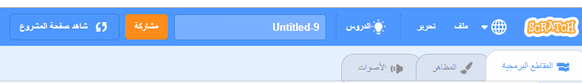
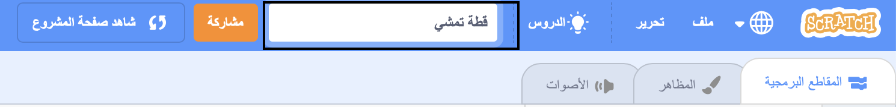
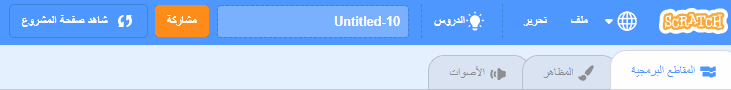
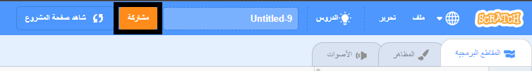
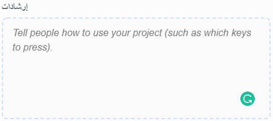
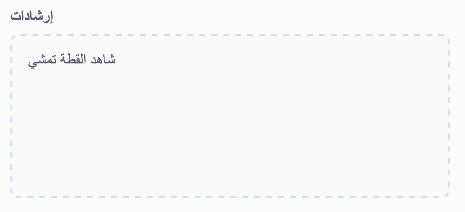
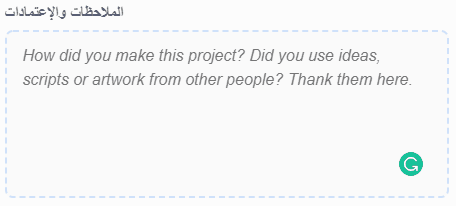
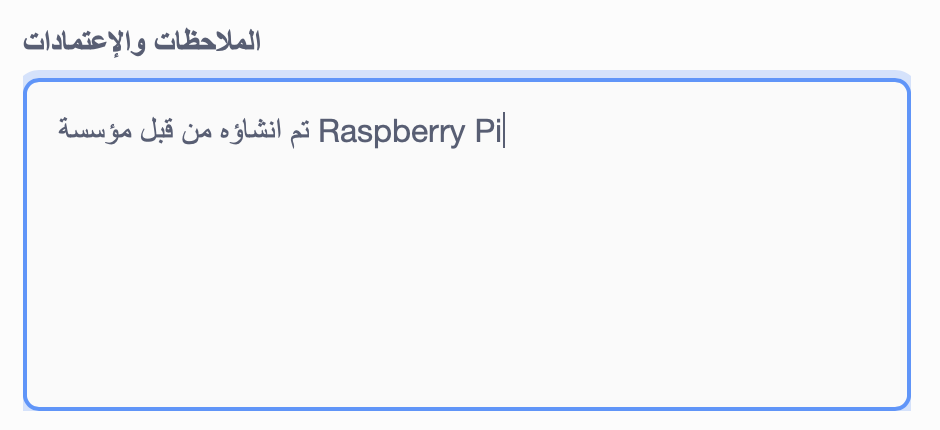
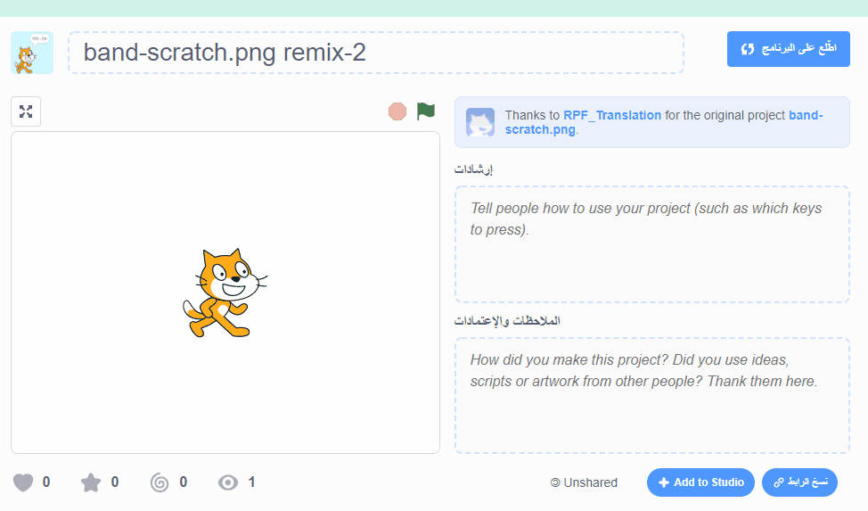
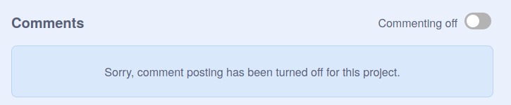

يرجى التأكد من أنك **لا** تشارك أي معلومات شخصية عن نفسك عندما تشارك مشاريع سكراتش الخاصة بك.

- امنح مشروع سكراتش اسمًا.

--- no-print ---

--- /no-print ---

--- print-only ---

{:width="300px"}

--- /print-only ---

- انقر فوق **مشاركة** لجعل المشروع عامًا.

--- no-print ---

--- /no-print ---

--- print-only ---

{:width="300px"}

--- /print-only ---

- If you like, you can add instructions in the **Instructions** box, to tell other people how to use your project.

--- no-print ---

--- /no-print ---

--- print-only ---

{:width="300px"}

--- /print-only ---

- You can also fill in the **Notes and Credits** box: if you have made an original project, you can write some short comments, or if you have remixed a project, you can credit the original creator.

--- no-print ---

--- /no-print ---

--- print-only ---

{:width="300px"}

--- /print-only ---

- انقر فوق **نسخ الرابط** للحصول على رابط مشروعك. يمكنك إرسال هذا الرابط إلى أشخاص آخرين عبر البريد الإلكتروني أو الرسائل النصية أو على وسائل التواصل الاجتماعي.

--- no-print ---

--- /no-print ---

--- print-only ---

{:width="300px"}

--- /print-only ---

يوفر سكراتش القدرة على التعليق على مشاريعك الخاصة ومشاريع الآخرين. إذا كنت لا تريد السماح للأشخاص بالتعليق على مشروعك ، فيجب عليك إيقاف التعليق. To turn off commenting, set the slider above the **Comments** box to **Commenting off**.

{:width="300px"}
