Si us plau, assegurat que **no** comparteixes cap informació personal de tu mateix quan estàs compartint els teus projectes Scratch.

- Dona-li un nom al teu projecte Scratch.

--- no-print ---

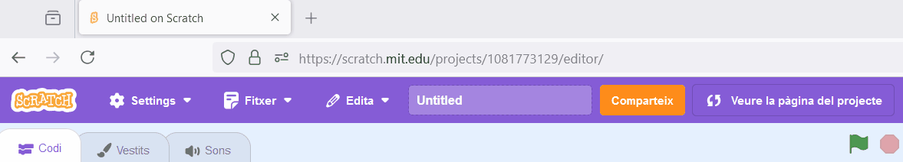

--- /no-print ---

--- print-only ---

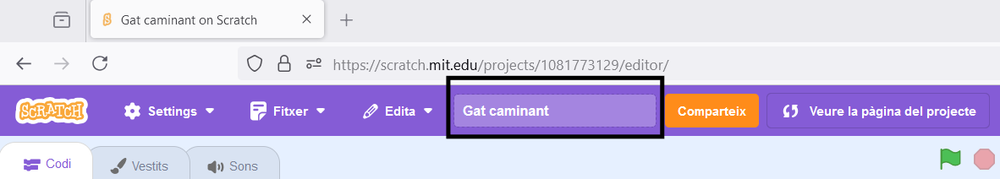{:width="300px"}

--- /print-only ---

- Feu clic al botó **Comparteix** per fer públic el projecte.

--- no-print ---

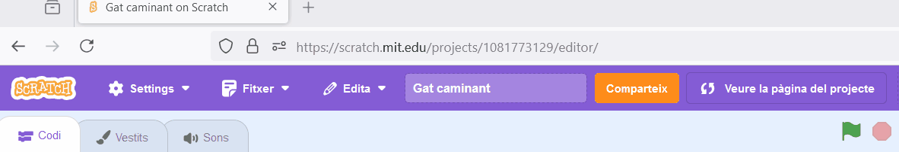

--- /no-print ---

--- print-only ---

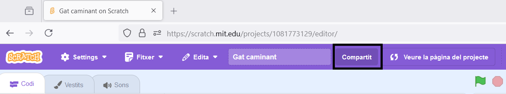{:width="300px"}

--- /print-only ---

- Si vols, pots afegir instruccions al quadre **Instruccions** per dir a altres persones com utilitzar el teu projecte.

--- no-print ---

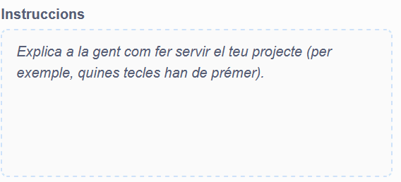

--- /no-print ---

--- print-only ---

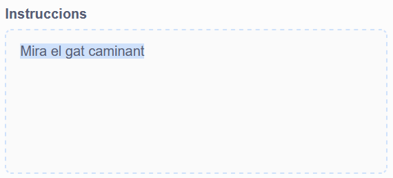{:width="300px"}

--- /print-only ---

- També pots omplir el quadre **Notes i crèdits**: si heu fet un projecte original, pots escriure alguns comentaris breus, o si heu reinventat un projecte, podeu acreditar el creador original.

--- no-print ---

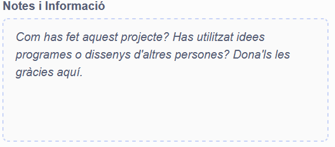

--- /no-print ---

--- print-only ---

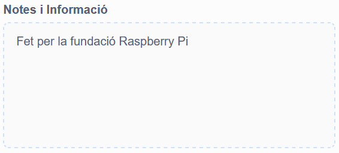{:width="300px"}

--- /print-only ---

- Fes clic al botó **Copia l'enllaç** per obtenir l'enllaç al teu projecte. Pots enviar aquest enllaç a altres persones per correu electrònic o missatge de text, o a les xarxes socials.

--- no-print ---

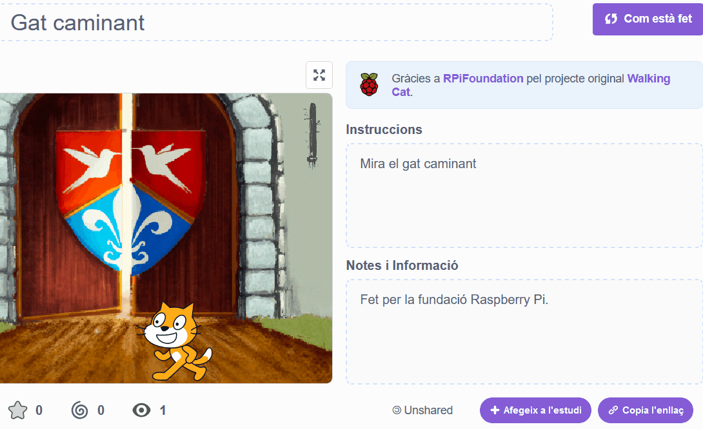

--- /no-print ---

--- print-only ---

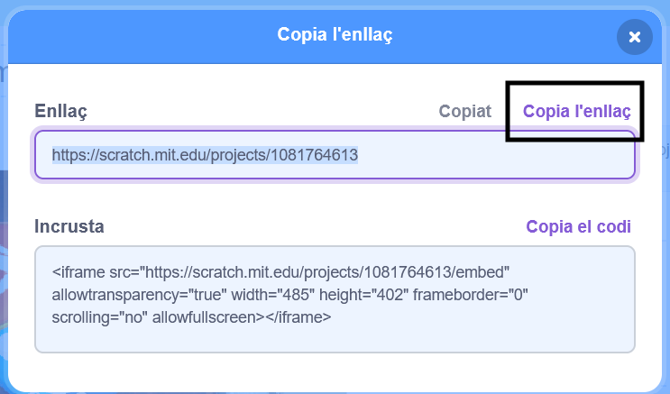{:width="300px"}

--- /print-only ---

Scratch ofereix la possibilitat de comentar projectes propis i d'altres persones. Si no voleu permetre que la gent faci comentaris sobre el vostre projecte, hauríeu de desactivar els comentaris. Per desactivar els comentaris, posa el control lliscant a sobre del quadre **Comentaris** a **Comentaris desactivats**.

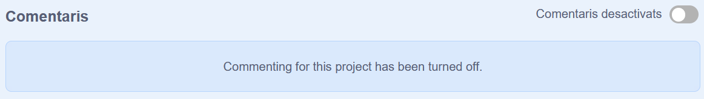{:width="300px"}
