Když sdílíš svůj projekt ve Scratchi, **nikdy** nesdílej žádné osobní informace.

- Pojmenuj svůj projekt ve Scratchi.

--- no-print ---

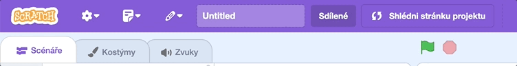

--- /no-print ---

--- print-only ---

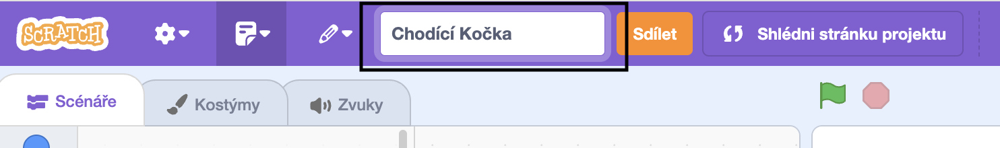{:width="300px"}

--- /print-only ---

- Klikni na tlačítko **Sdílet**. Tím se stane projekt veřejným.

--- no-print ---

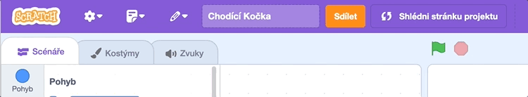

--- /no-print ---

--- print-only ---

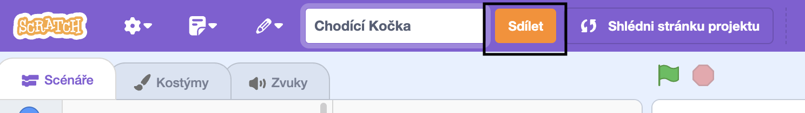{:width="300px"}

--- /print-only ---

- Pokud chceš, můžeš do kolonky **Návody** přidat pro ostatní instrukce, jak správně projekt použít.

--- no-print ---

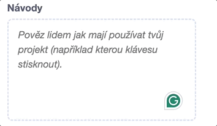

--- /no-print ---

--- print-only ---

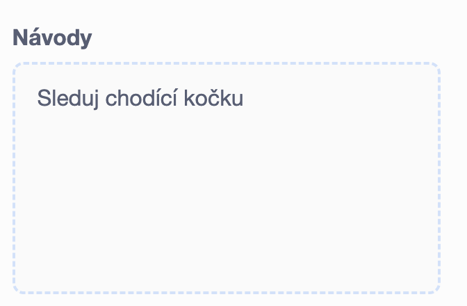{:width="300px"}

--- /print-only ---

- Můžeš vyplnit také kolonku **Poznámky a zásluhy**: pokud je projekt originální, můžeš to krátce zmínit. Pokud jsi projekt remixoval, můžeš zmínit původního bastlíře.

--- no-print ---

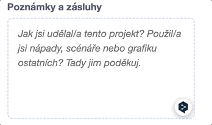

--- /no-print ---

--- print-only ---

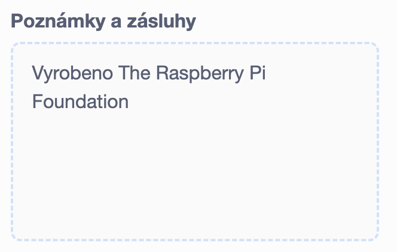{:width="300px"}

--- /print-only ---

- Klikni na tlačítko **Zkopíruj odkaz** abys získal odkaz na svůj projekt. Ten můžeš sdílet ostatním pomocí emailu, SMS, či na sociální sítě.

--- no-print ---

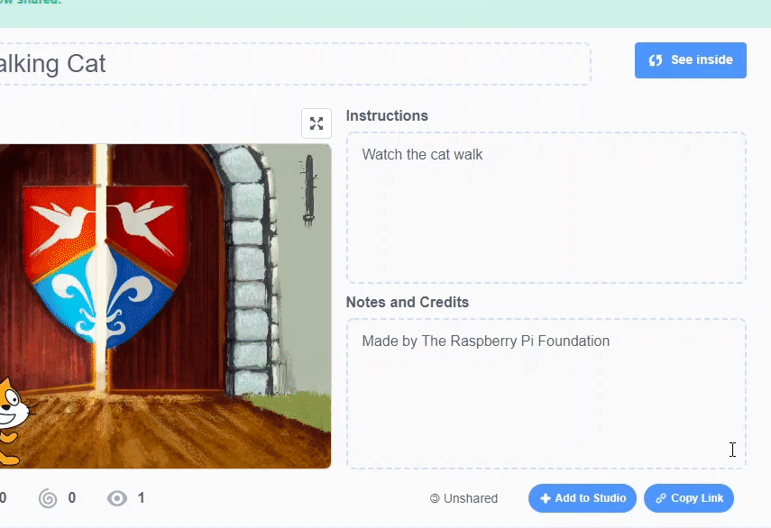

--- /no-print ---

--- print-only ---

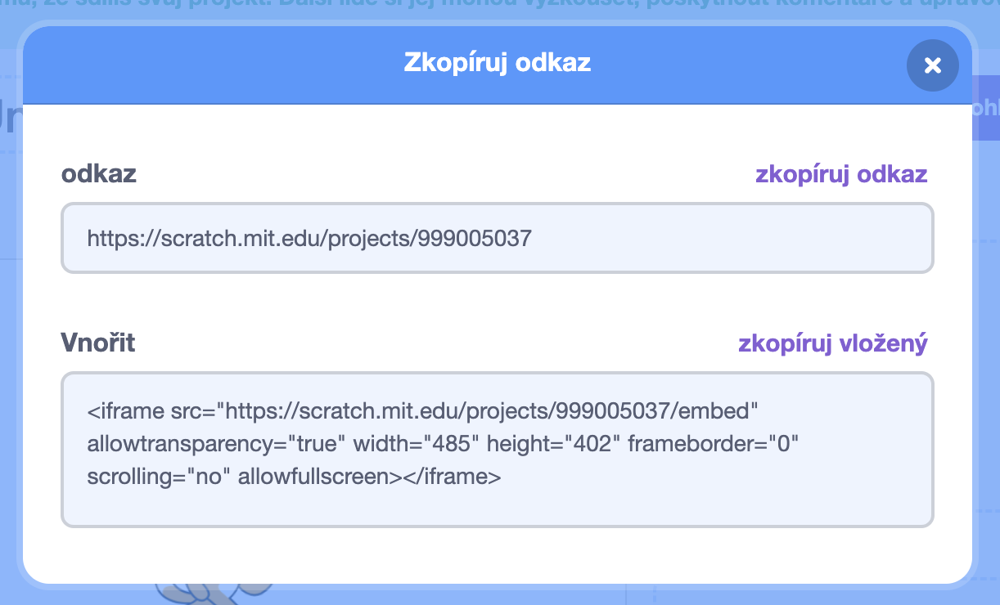{:width="300px"}

--- /print-only ---

Scratch umožňuje ostatním komentovat vlastní projekty i projekty ostatních. Pokud nechceš, aby lidé měli možnost projekt komentovat, můžeš komentáře vypnout. Pro vypnutí komentářů nastav přepínač umístěný nad políčkem **Komentáře** do stavu **Zablokovat komentáře**.

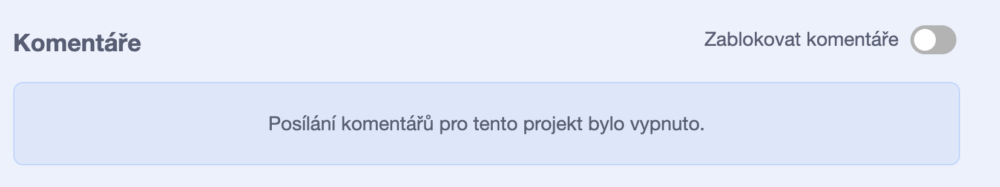{:width="300px"}
