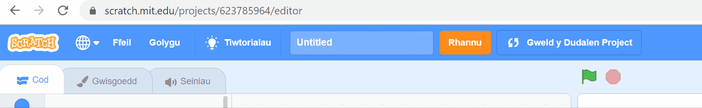
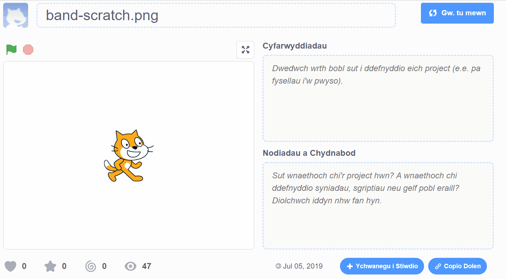

Gwna'n siŵr **nad wyt** ti'n rhannu unrhyw wybodaeth bersonol amdanat ti dy hun wrth rannu dy brosiectau Scratch.

- Rho enw i dy brosiect Scratch.

--- no-print ---

--- /no-print ---

--- print-only ---

{:width="300px"}

--- /print-only ---

- Clicia'r botwm **Rhannu** i wneud y prosiect yn gyhoeddus.

--- no-print ---

--- /no-print ---

--- print-only ---

{:width="300px"}

--- /print-only ---

- Os wyt ti eisiau, galli di ychwanegu cyfarwyddiadau yn y blwch **Cyfarwyddiadau**, i ddweud wrth bobl eraill sut i ddefnyddio dy brosiect.

--- no-print ---

--- /no-print ---

--- print-only ---

{:width="300px"}

--- /print-only ---

- Galli di hefyd lenwi'r blwch **Nodiadau a Chydnabod**: os wyt ti wedi creu prosiect gwreiddiol, galli di ysgrifennu rhai sylwadau byr, neu os wyt ti wedi ailgymysgu prosiect, galli di gydnabod y dylunydd gwreiddiol.

--- no-print ---

--- /no-print ---

--- print-only ---

{:width="300px"}

--- /print-only ---

- Clicia'r botwm **Copïo Dolen** i gael y ddolen i dy brosiect. Galli di anfon y ddolen hon at bobl eraill drwy e-bost neu neges destun, neu ar gyfryngau cymdeithasol.

--- no-print ---

--- /no-print ---

--- print-only ---

{:width="300px"}

--- /print-only ---

Mae Scratch yn darparu'r gallu i roi sylwadau ar dy brosiectau di a phrosiectau pobl eraill. Os nad wyt ti am ganiatáu i bobl roi sylwadau ar dy brosiect, dylet ti ddiffodd gwneud sylwadau. I ddiffodd sylwadau, gosoda'r llithrydd uwchben y blwch **Sylwadau** i **Sylwadau wedi diffodd**.

{:width="300px"}
