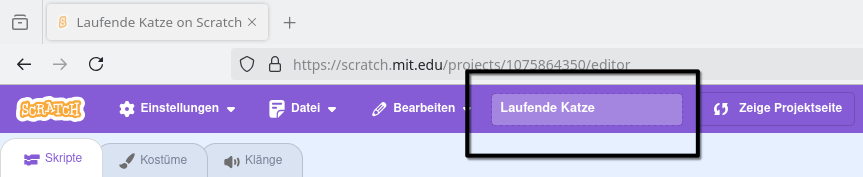
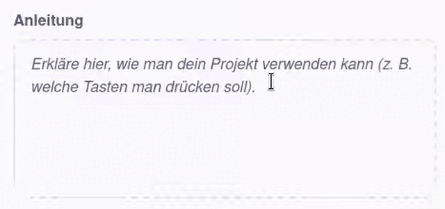

Bitte stelle sicher, dass du **keine** persönlichen Informationen über dich selbst weitergibst, wenn du deine Scratch-Projekte teilst.

- Gib deinem Scratch-Projekt einen Namen.

--- no-print ---

--- /no-print ---

--- print-only ---

{:width="300px"}

--- /print-only ---

- Klicke auf die Schaltfläche **Teilen**, um das Projekt öffentlich zu machen.

--- no-print ---

--- /no-print ---

--- print-only ---

{:width="300px"}

--- /print-only ---

- Wenn du möchtest, kannst du im Feld **Anweisungen** Anweisungen hinzufügen, um anderen Personen die Verwendung deines Projekts zu erklären.

--- no-print ---

--- /no-print ---

--- print-only ---

{:width="300px"}

--- /print-only ---

- Du kannst auch das Feld „ **Anmerkungen und Credits** “ ausfüllen: Wenn du ein Originalprojekt erstellt hast, kannst du einige kurze Kommentare schreiben, oder wenn du ein Projekt geremixt hast, kannst du den ursprünglichen Ersteller angeben.

--- no-print ---

--- /no-print ---

--- print-only ---

{:width="300px"}

--- /print-only ---

- Klicke auf die Schaltfläche **Link kopieren**, um den Link zu deinem Projekt zu erhalten. Du kannst diesen Link per E-Mail, Nachricht oder über soziale Medien an andere Personen senden.

--- no-print ---

--- /no-print ---

--- print-only ---

{:width="300px"}

--- /print-only ---

Scratch bietet die Möglichkeit, eigene und die Projekte anderer zu kommentieren. Wenn du nicht möchtest, dass andere Personen dein Projekt kommentieren, solltest du die Kommentarfunktion deaktivieren. Um das Kommentieren auszuschalten, stelle den Schieberegler über dem Feld **Kommentare** auf **Kommentieren aus**.

{:width="300px"}
