Βεβαιώσου πως **δεν** μοιράζεσαι κανενός είδους προσωπικές πληροφορίες όταν κάνεις διαμοιρασμό των Scratch έργων σου.

- Δώσε ένα όνομα στο Scratch έργο σου.

--- no-print ---

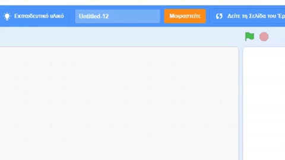

--- /no-print ---

--- print-only ---

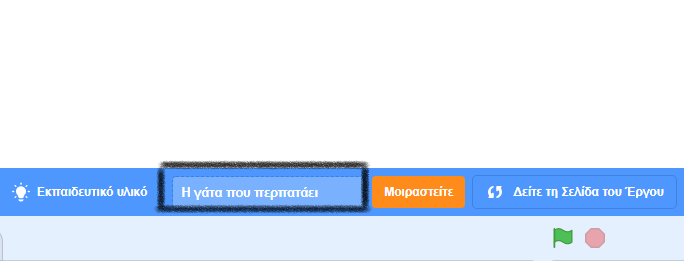{:width="300px"}

--- /print-only ---

- Κάνε κλικ στο κουμπί **Μοιραστείτε** για να δημοσιοποιήσεις το έργο σου.

--- no-print ---

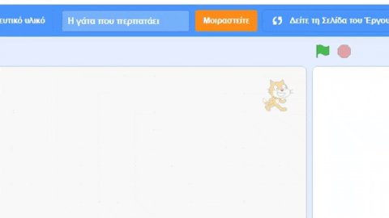

--- /no-print ---

--- print-only ---

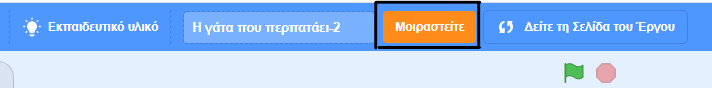{:width="300px"}

--- /print-only ---

- Εάν θέλεις, μπορείτε να προσθέσεις οδηγίες στο πλαίσιο **Οδηγίες**, για να πεις σε άλλους ανθρώπους πώς να χρησιμοποιούν το έργο σου.

--- no-print ---

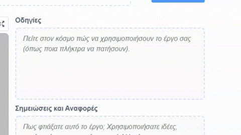

--- /no-print ---

--- print-only ---

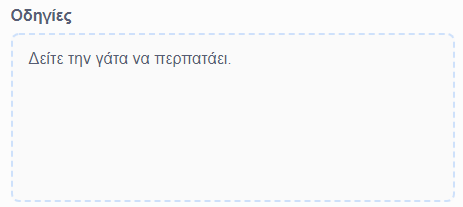{:width="300px"}

--- /print-only ---

- Μπορείς επίσης να συμπληρώσεις το πλαίσιο **Σημειώσεις και Αναφορές**: εάν έχεις κάνει ένα πρωτότυπο έργο, μπορείς να γράψεις μερικά σύντομα σχόλια ή εάν έχεις εμπλουτίσει ένα έργο, μπορείς να αναφέρεις τον αρχικό δημιουργό.

--- no-print ---

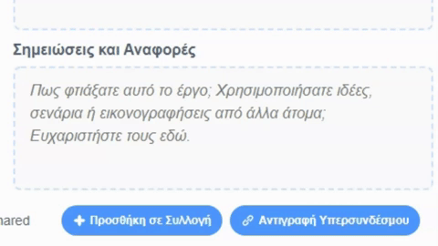

--- /no-print ---

--- print-only ---

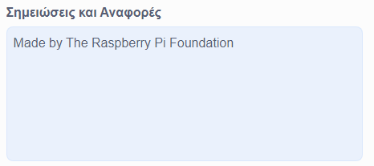{:width="300px"}

--- /print-only ---

- Κάνε κλικ στο κουμπί **Αντιγραφή Υπερσυνδέσμου** για να λάβεις τον σύνδεσμο για το έργο σου. Μπορείς να στείλεις αυτόν τον σύνδεσμο σε άλλα άτομα μέσω ηλεκτρονικού ταχυδρομείου ή κειμένου είτε μέσω κοινωνικών δικτύων.

--- no-print ---

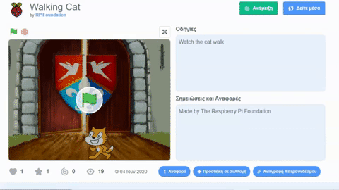

--- /no-print ---

--- print-only ---

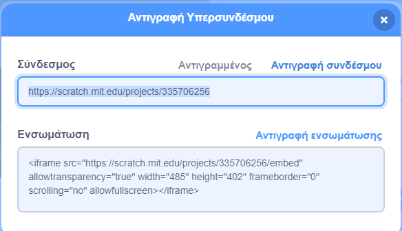{:width="300px"}

--- /print-only ---

Το Scratch παρέχει τη δυνατότητα σχολιασμού τόσο των έργων σου όσο και των έργων άλλων. Αν δεν θες να επιτρέψεις σε άλλους να σχολιάζουν το έργο σου, θα πρέπει να απενεργοποιήσεις τα σχόλια. Για να απενεργοποιήσεις τον σχολιασμό, πήγαινε στη Σελίδα Έργου και όρισε το διακόπτη πάνω από το πλαίσιο **Σχόλια** στην επιλογή **Ανενεργός Σχολιασμός**.

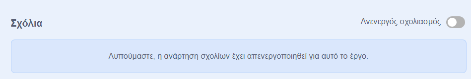{:width="300px"}

