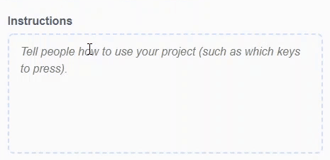
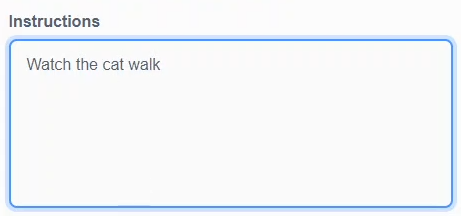

Please make sure that you **do not** share any personal information about yourself when sharing your Scratch projects.

- Give your Scratch project a name.

--- no-print ---

--- /no-print ---

--- print-only ---

{:width="300px"}

--- /print-only ---

- Click the **Share** button to make the project public.

--- no-print ---

--- /no-print ---

--- print-only ---

{:width="300px"}

--- /print-only ---

- If you like, you can add instructions to tell other people how to use your project.

--- no-print ---

--- /no-print ---

--- print-only ---

{:width="300px"}

--- /print-only ---

- If this is an original project, you can add some short comments. If you have remixed it, you can credit the original creator.

--- no-print ---

--- /no-print ---

--- print-only ---

{:width="300px"}

--- /print-only ---

- Click the **Copy Link** button to get the link to your project. You can send this link to other people by email or text, or on social media.

--- no-print ---

--- /no-print ---

--- print-only ---

{:width="300px"}

--- /print-only ---

Scratch provides the ability to comment on your own and other people's projects. If you do not want to allow people to comment on your project, you should turn off commenting.

{:width="300px"}
