Por favor asegúrate de que **no** compartas cualquier información personal sobre ti cuando compartas tus proyectos en Scratch.

- Dale un nombre a tu proyecto Scratch.

--- no-print ---

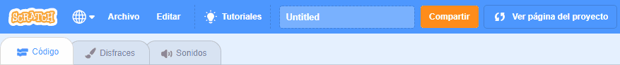

--- /no-print ---

--- print-only ---

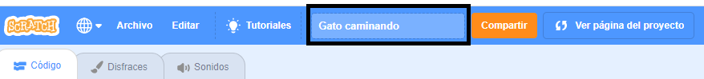{:width="300px"}

--- /print-only ---

- Haz clic en el botón **Compartir** para hacer público el proyecto.

--- no-print ---

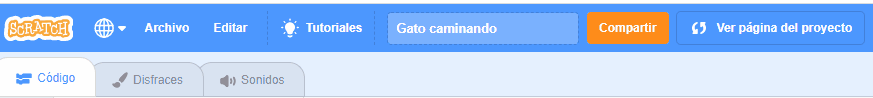

--- /no-print ---

--- print-only ---

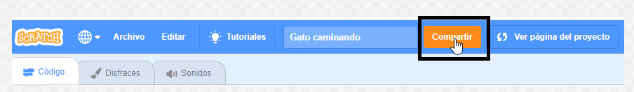{:width="300px"}

--- /print-only ---

- Si quieres, puedes agregar instrucciones en el cuadro **Instrucciones**, para decirle a otras personas cómo usar tu proyecto.

--- no-print ---

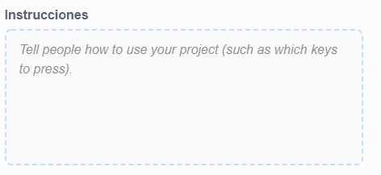

--- /no-print ---

--- print-only ---

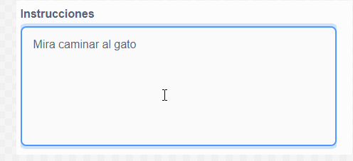{:width="300px"}

--- /print-only ---

- También puedes completar el cuadro **Notas y Créditos**: si has realizado un proyecto original, puedes escribir algunos comentarios cortos, o si has remezclado un proyecto, puedes acreditar al creador original.

--- no-print ---

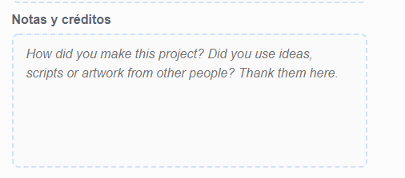

--- /no-print ---

--- print-only ---

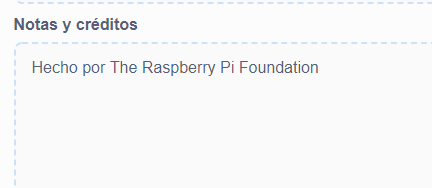{:width="300px"}

--- /print-only ---

- Haz clic en el botón **Copiar enlace** para obtener el enlace a tu proyecto. Puedes enviar este enlace a otras personas por correo electrónico o mensaje de texto, o en las redes sociales.

--- no-print ---

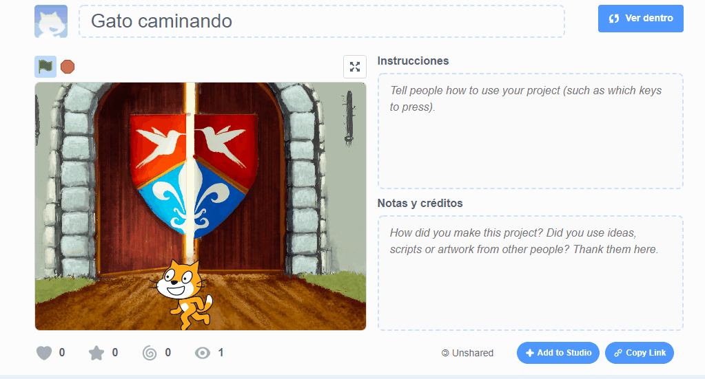

--- /no-print ---

--- print-only ---

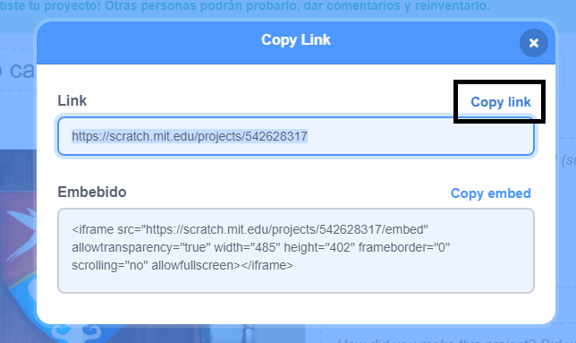{:width="300px"}

--- /print-only ---

Scratch ofrece la posibilidad de comentar sobre proyectos propios y ajenos. Si no quieres permitir que las personas comenten sobre tu proyecto, debes deshabilitar los comentarios. Para hacer esto, fija el deslizador sobre el cuadro **Comentarios** en la posición **Comentarios deshabilitados**.

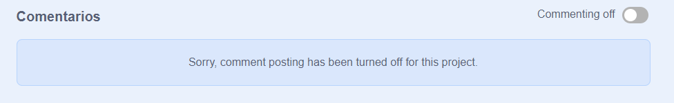{:width="300px"}
