Fais attention de **ne pas** partager tes informations personnelles quand tu partages tes projets Scratch.

- Donne un nom à ton projet Scratch.

--- no-print ---

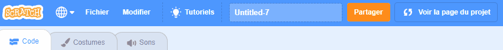

--- /no-print ---

--- print-only ---

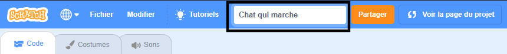{:width="300px"}

--- /print-only ---

- Clique sur le bouton **Partager** pour rendre le projet public.

--- no-print ---

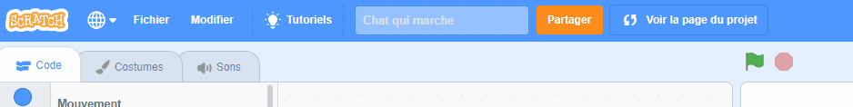

--- /no-print ---

--- print-only ---

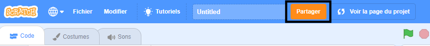{:width="300px"}

--- /print-only ---

- Si tu le souhaites, tu peux ajouter des instructions pour indiquer à d'autres personnes comment utiliser ton projet.

--- no-print ---

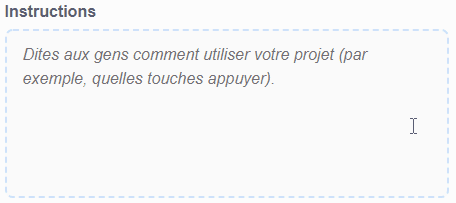

--- /no-print ---

--- print-only ---

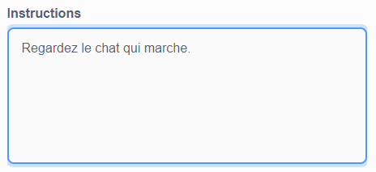{:width="300px"}

--- /print-only ---

- S'il s'agit d'un projet original, tu peux ajouter quelques brefs commentaires. Si tu l'as remixé, tu peux créditer le créateur original.

--- no-print ---

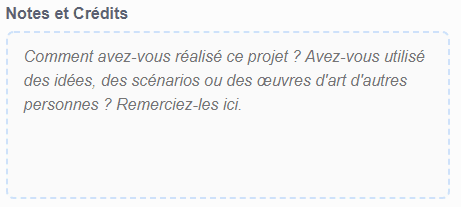

--- /no-print ---

--- print-only ---

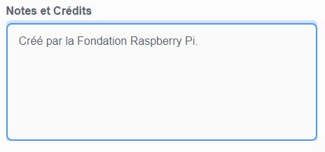{:width="300px"}

--- /print-only ---

- Clique sur le bouton **Copier le lien** pour obtenir le lien vers ton projet. Tu peux envoyer ce lien à d'autres personnes par e-mail ou SMS, ou sur les réseaux sociaux.

--- no-print ---

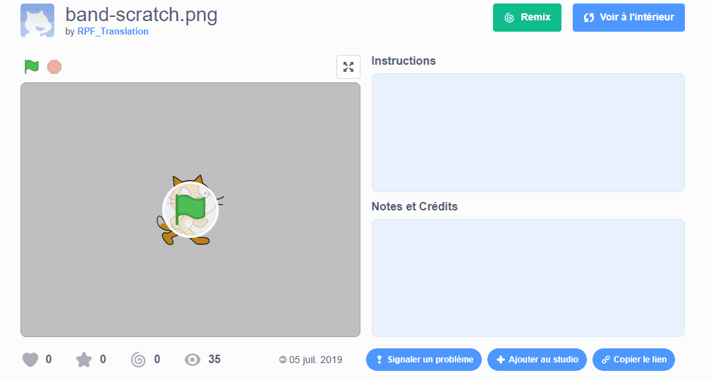

--- /no-print ---

--- print-only ---

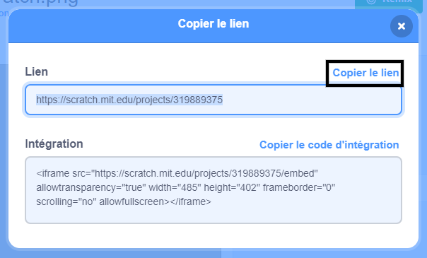{:width="300px"}

--- /print-only ---

Scratch offre la possibilité de commenter tes propres projets et ceux des autres. Si tu ne souhaites pas autoriser les utilisateurs à commenter ton projet, tu dois désactiver les commentaires.

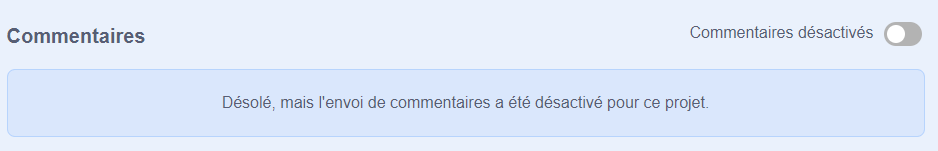{:width="300px"}
