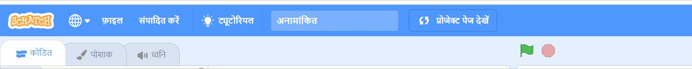
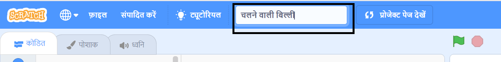
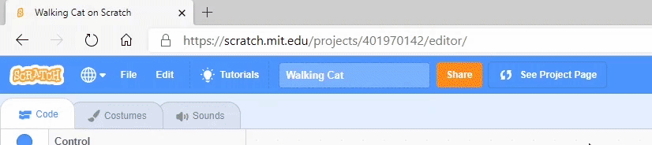
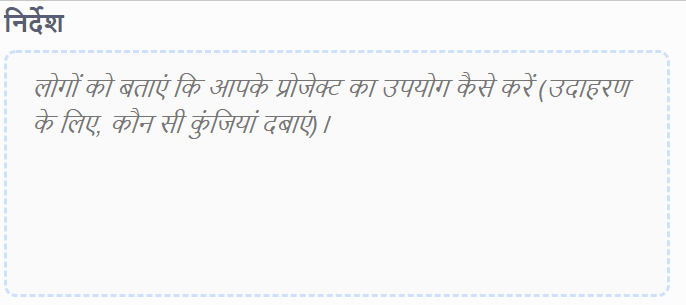
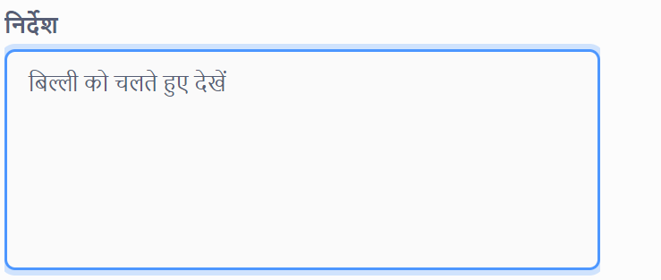
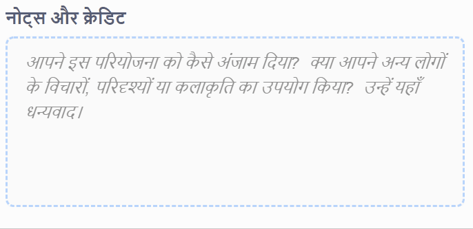
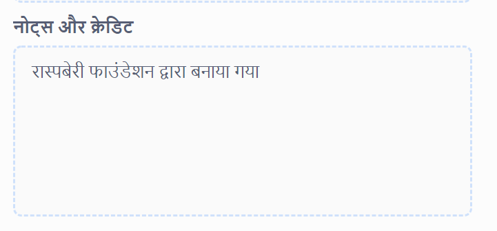
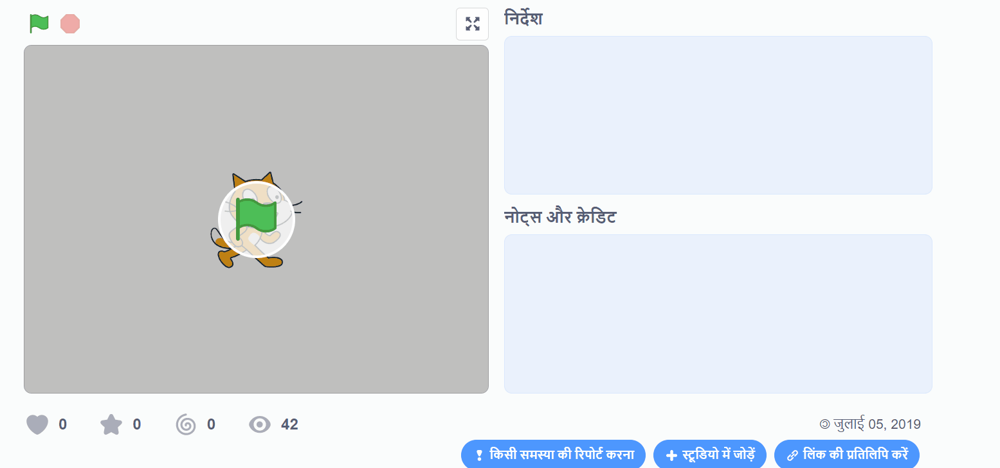
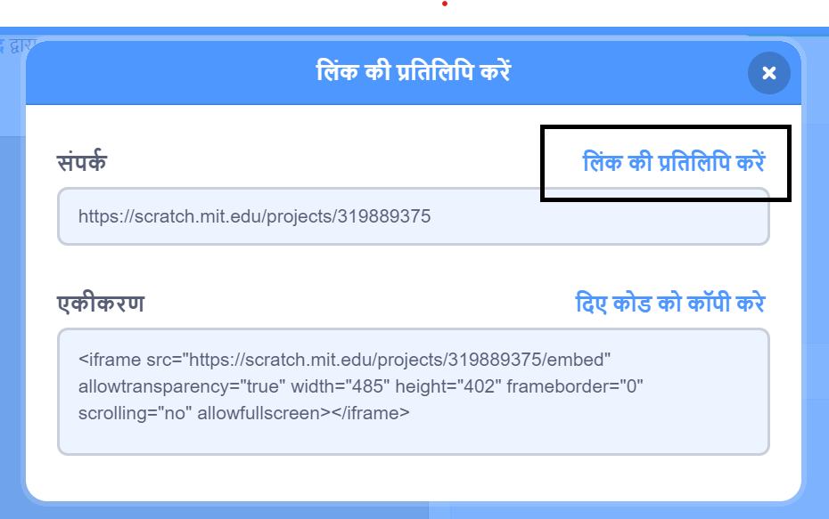
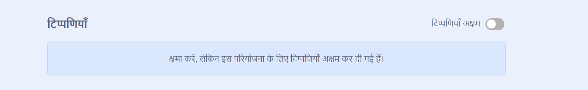

सुनिश्चित करें कि आप Scratch प्रोजेक्ट्स को साझा करते समय कोई भी व्यक्तिगत जानकारी साझा **नहीं** करें ।

- अपने Scratch प्रोजेक्ट को एक नाम दें।

--- no-print ---

--- /no-print ---

--- print-only ---

{:width="300px"}

--- /print-only ---

- प्रोजेक्ट को सार्वजनिक करने के लिए **Share** बटन पर क्लिक करें ।

--- no-print ---

--- /no-print ---

--- print-only ---

{:width="300px"}

--- /print-only ---

- यदि आप चाहें, तो आप अन्य लोगों को अपने प्रोजेक्ट का उपयोग करने का तरीका बताने के लिए, **Instructions** बॉक्स में निर्देश जोड़ सकते हैं।

--- no-print ---

--- /no-print ---

--- print-only ---

{:width="300px"}

--- /print-only ---

- आप **Notes and Credits** बॉक्स भी भर सकते हैं: यदि आपने एक मूल प्रोजेक्ट बनाया है, तो आप कुछ छोटी टिप्पणियाँ लिख सकते हैं, या यदि आपने किसी प्रोजेक्ट को रीमिक्स किया है, तो आप मूल निर्माता को क्रेडिट दे सकते हैं।

--- no-print ---

--- /no-print ---

--- print-only ---

{:width="300px"}

--- /print-only ---

- अपने प्रोजेक्ट का लिंक प्राप्त करने के लिए **Copy Link** बटन पर क्लिक करें। आप इस लिंक को अन्य लोगों को ईमेल या टेक्स्ट या सोशल मीडिया पर भेज सकते हैं।

--- no-print ---

--- /no-print ---

--- print-only ---

{:width="300px"}

--- /print-only ---

Scratch आपके और अन्य लोगों की प्रोजेक्ट पर टिप्पणी करने की क्षमता प्रदान करता है। यदि आप लोगों को अपने प्रोजेक्ट पर टिप्पणी करने की अनुमति नहीं देना चाहते हैं, तो आपको टिप्पणी कराना बंद कर देना चाहिए। टिप्पणी करना बंद करने के लिए, स्लाइडर को <**Comments** box to **Commenting off** के ऊपर सेट करें ।

{:width="300px"}
