Provjeri da **ne** dijeliš nikakve osobne podatke o sebi kada dijeliš svoje Scratch projekte.

- Daj naziv svom Scratch projektu.

--- no-print ---

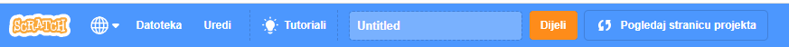

--- /no-print ---

--- print-only ---

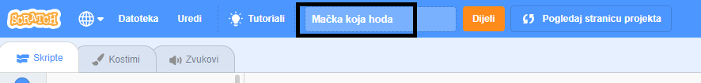{:width="300px"}

--- /print-only ---

- Pritisni gumb **Dijeli** da bi projekt učinio/la javnim.

--- no-print ---

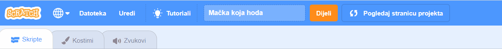

--- /no-print ---

--- print-only ---

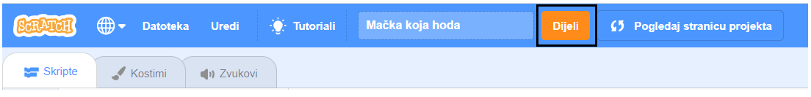{:width="300px"}

--- /print-only ---

- Ako želiš, možeš dodati upute u okvir **Upute** da drugima objasniš kako koristiti tvoj projekt.

--- no-print ---

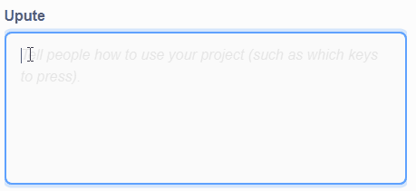

--- /no-print ---

--- print-only ---

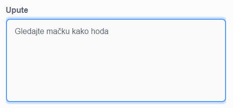{:width="300px"}

--- /print-only ---

- Također možeš ispuniti polje **Notes and Credits (Napomene i zasluge)**. Ako si napravio/la izvorni projekt, možeš napisati nekoliko kratkih komentara ili ako si remiksirao/la projekt, možeš dati zasluge izvornom kreatoru/ici.

--- no-print ---

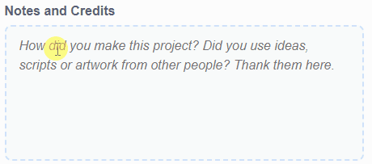

--- /no-print ---

--- print-only ---

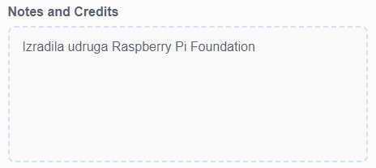{:width="300px"}

--- /print-only ---

- Klikni na gumb **Copy Link (Kopiraj poveznicu)** da dobiješ poveznicu za svoj projekt. Ovu poveznicu možeš poslati drugim ljudima e-poštom, porukom ili putem društvenih mreža.

--- no-print ---

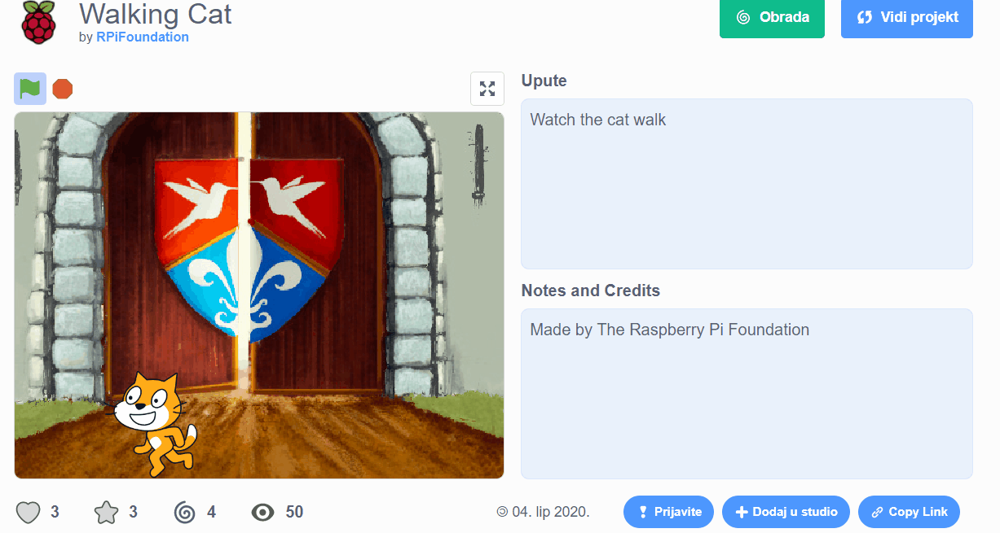

--- /no-print ---

--- print-only ---

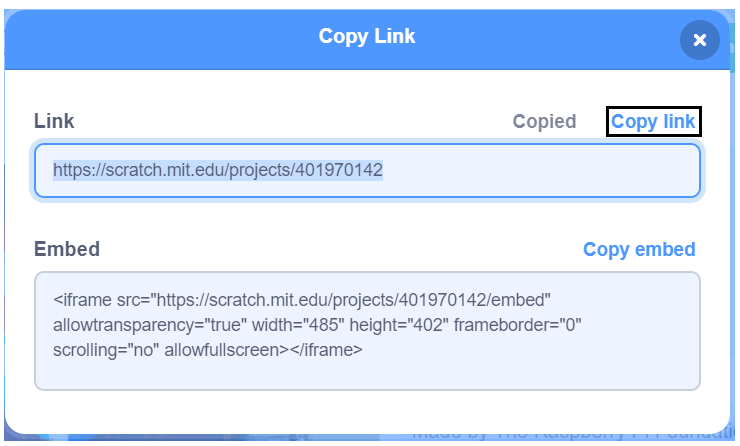{:width="300px"}

--- /print-only ---

Scratch pruža mogućnost komentiranja vlastitih i tuđih projekata. Ako ne želiš dopustiti ljudima da komentiraju tvoj projekt, moraš isključiti opciju komentiranja. Da isključiš opciju komentiranja, postavi klizač iznad okvira **Komentari** na **Commenting off (Komentiranje isključeno)**.

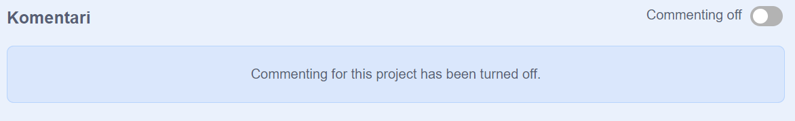{:width="300px"}
