Assicurati di **non fornire** alcuna informazione personale su di te quando condividi i tuoi progetti Scratch.

- Dai un nome al tuo progetto Scratch.

--- no-print ---

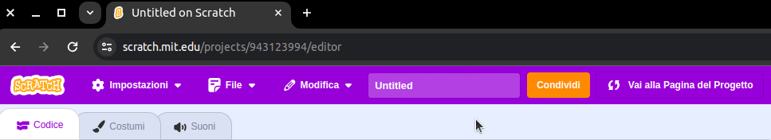

--- /no-print ---

--- print-only ---

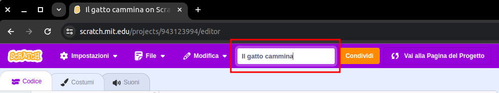{:width="300px"}

--- /print-only ---

- Fai clic sul pulsante **Condividi** per pubblicare il progetto.

--- no-print ---

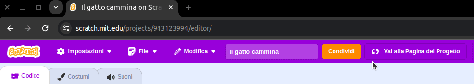

--- /no-print ---

--- print-only ---

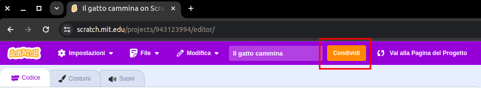{:width="300px"}

--- /print-only ---

- Se vuoi, puoi aggiungere delle istruzioni nella casella **Istruzioni**, per spiegare alle altre persone come usare il tuo progetto.

--- no-print ---

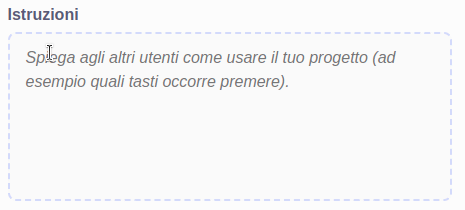

--- /no-print ---

--- print-only ---

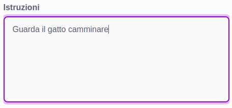{:width="300px"}

--- /print-only ---

- Puoi anche compilare la casella **Note e Crediti**: se hai realizzato un progetto originale, puoi scrivere alcuni commenti, oppure se hai fatto il 'remix' di un progetto, puoi citare l'autore originale.

--- no-print ---

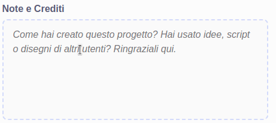

--- /no-print ---

--- print-only ---

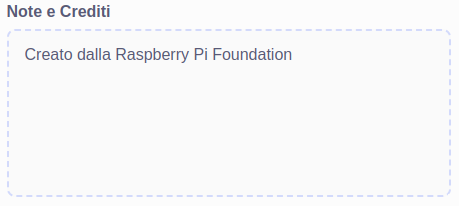{:width="300px"}

--- /print-only ---

- Fai clic sul pulsante **Copia collegamento** per ottenere il collegamento al tuo progetto. Puoi inviare questo collegamento ad altre persone tramite e-mail, messaggio o sui social media.

--- no-print ---

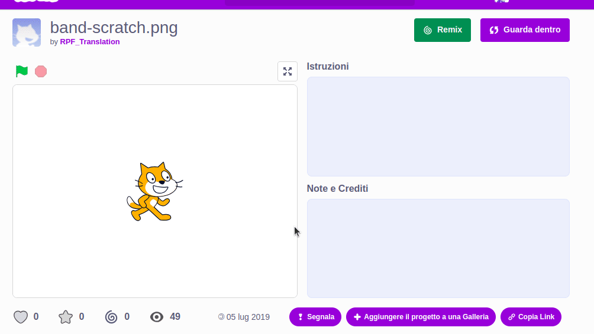

--- /no-print ---

--- print-only ---

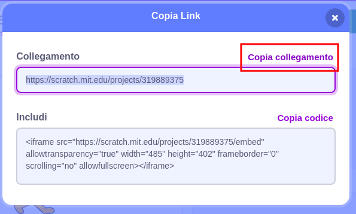{:width="300px"}

--- /print-only ---

Scratch dà la possibilità di commentare i tuoi progetti e quelli di altre persone. Se non vuoi consentire alle persone di commentare il tuo progetto, puoi disattivare i commenti. Per disattivare i commenti, sposta il cursore sopra la casella **Commenti** su **Commenti disattivati**.

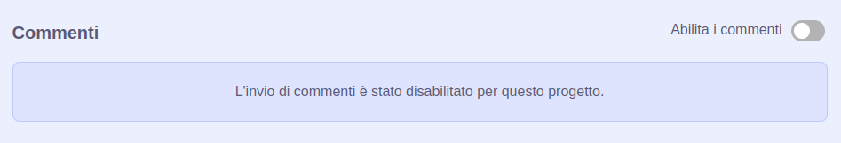{:width="300px"}
