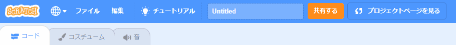

Scratchプロジェクトを共有する時には、あなた自身の個人情報を**共有しない**ことを確認してください。

- Scratchプロジェクトに名前を付けます。

--- no-print ---

--- /no-print ---

--- print-only ---

{:width="300px"}

--- /print-only ---

- プロジェクトを公開するには**共有する**ボタンをクリックします。

--- no-print ---

--- /no-print ---

--- print-only ---

{:width="300px"}

--- /print-only ---

- 必要に応じて、**使い方**ボックスに使い方の説明を追加して、プロジェクトの使用方法を他の人に伝えることができます。

--- no-print ---

--- /no-print ---

--- print-only ---

{:width="300px"}

--- /print-only ---

- **メモとクレジット**ボックスに入力することもできます。オリジナルのプロジェクトを作成した場合は短いコメントを書くことができ、別のプロジェクトをリミックスした場合は元の作成者のクレジットを付けることができます。

--- no-print ---

--- /no-print ---

--- print-only ---

{:width="300px"}

--- /print-only ---

- **リンクをコピー**ボタンをクリックして、プロジェクトへのリンクを取得します。 このリンクは、電子メールやテキスト、またはソーシャルメディアで他の人に送信できます。

--- no-print ---

--- /no-print ---

--- print-only ---

{:width="300px"}

--- /print-only ---

Scratchは自分自身や他の人のプロジェクトにコメントする機能を提供しています。 他の人が自分のプロジェクトへコメントすることを許可したくない場合は、コメント機能をオフにする必要があります。 コメント機能をオフにするには、**コメント**ボックスの上にあるスライダーを**コメントはオフです**に設定します。

{:width="300px"}
