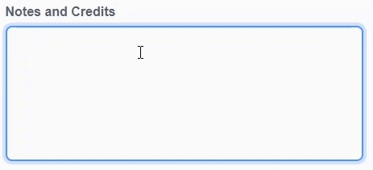

ನಿಮ್ಮ ಸ್ಕ್ರ್ಯಾಚ್ ಯೋಜನೆಗಳು ಹಂಚಿಕೊಳ್ಳುವಾಗ ನಿಮ್ಮ ವೈಯಕ್ತಿಕ ಮಾಹಿತಿಯನ್ನು ದಯವಿಟ್ಟು **ಹಂಚದಿರಿ**.

- ನಿಮ್ಮ ಸ್ಕ್ರಾಚ್ ಯೋಜನೆಗೆ ಹೆಸರನ್ನು ನೀಡಿ.

--- no-print ---

--- /no-print ---

--- print-only ---

{:width="300px"}

--- /print-only ---

- ಯೋಜನೆಯನ್ನು ಇತರರೊಂದಿಗೆ ಹಂಚಲು **Share** ಬಟನ್ ಕ್ಲಿಕ್ ಮಾಡಿ.

--- no-print ---

--- /no-print ---

--- print-only ---

{:width="300px"}

--- /print-only ---

- ನೀವು ಬಯಸಿದರೆ, **Instructions** ಬಾಕ್ಸ್‌ನಲ್ಲಿ ನಿಮ್ಮ ಯೋಜನೆಯನ್ನು ಹೇಗೆ ಬಳಸಬೇಕೆಂದು ಇತರರಿಗೆ ತಿಳಿಸಲು ಮಾಹಿತಿಯನ್ನು ಸೇರಿಸಬಹುದು.

--- no-print ---

--- /no-print ---

--- print-only ---

{:width="300px"}

--- /print-only ---

- **Notes and Credits** ಬಾಕ್ಸ್ ಅನ್ನು ಭರ್ತಿ ಮಾಡಬಹುದು: ನೀವು ಮೂಲ ಪ್ರಾಜೆಕ್ಟ್ ಮಾಡಿದ್ದರೆ, ಕೆಲವು ಸಣ್ಣ ಕಾಮೆಂಟ್‌ಗಳನ್ನು ಬರೆಯಬಹುದು, ಅಥವಾ ಪ್ರಾಜೆಕ್ಟ್ ಅನ್ನು ರೀಮಿಕ್ಸ್ ಮಾಡಿದ್ದರೆ, ಮೂಲ ಸೃಷ್ಟಿಕರ್ತರಿಗೆ ಕ್ರೆಡಿಟ್ ಕೂಡ ಕೊಡಬಹುದು.

--- no-print ---

--- /no-print ---

--- print-only ---

{:width="300px"}

--- /print-only ---

- ನಿಮ್ಮ ಯೋಜನೆಯ ಲಿಂಕ್ ಪಡೆಯಲು **Copy Link** ಬಟನ್ ಕ್ಲಿಕ್ ಮಾಡಿ. ನೀವು ಈ ಲಿಂಕ್ ಅನ್ನು ಇತರರಿಗೆ ಇಮೇಲ್, ಸಂದೆೇಶದ ಮೂಲಕ ಅಥವಾ ಸಾಮಾಜಿಕ ಮಾಧ್ಯಮಗಳ ಮೂಲಕವೂ ಕಳುಹಿಸಬಹುದು.

--- no-print ---

--- /no-print ---

--- print-only ---

{:width="300px"}

--- /print-only ---

ಸ್ಕ್ರಾಚ್ ನಿಮ್ಮ ಮತ್ತು ಇತರರ ಯೋಜನೆಗಳ ಬಗ್ಗೆ ಕಾಮೆಂಟ್ ಮಾಡುವ ಸಾಮರ್ಥ್ಯವನ್ನು ಒದಗಿಸುತ್ತದೆ. ನಿಮ್ಮ ಪ್ರಾಜೆಕ್ಟ್‌ನಲ್ಲಿ ಕಾಮೆಂಟ್ ಮಾಡಲು ಜನರಿಗೆ ಅನುಮತಿಸಲು ನೀವು ಬಯಸದಿದ್ದರೆ, ನೀವು ಕಾಮೆಂಟ್ ಮಾಡುವುದನ್ನು ನಿಲ್ಲಿಸಬೇಕು. ಕಾಮೆಂಟ್ ಆಫ್ ಮಾಡಲು, **Comments** ಬಾಕ್ಸ್ ಮೇಲೆ ಇರುವ **Commenting off** ಕಡೆಗೆ ಸ್ಲೈಡ ಮಾಡಿ.

{:width="300px"}
