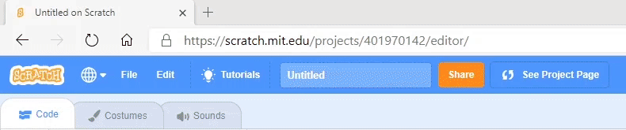
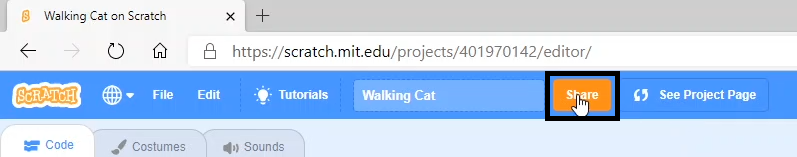
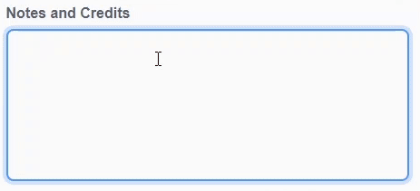
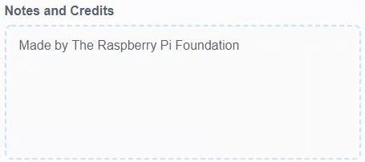
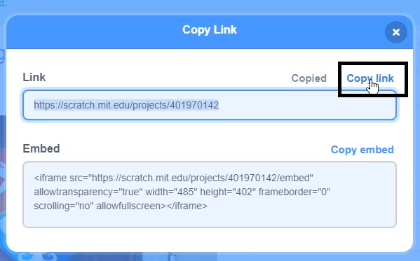

तुम्ही तुमचा Scratch प्रोजेक्ट शेअर करतांना स्वतःबद्दल कोणतिही खाजगी माहिती शेअर करणार **नाही** याची खात्री बाळगा.

- तुमच्या Scratch प्रोजेक्टला नाव द्या.

--- no-print ---

--- /no-print ---

--- print-only ---

{:width="300px"}

--- /print-only ---

- प्रोजेक्ट सार्वजनिक करण्यासाठी **Share** बटनवर क्लिक करा.

--- no-print ---

--- /no-print ---

--- print-only ---

{:width="300px"}

--- /print-only ---

- तुम्हाला आवडल्यास, तुमचा प्रोजेक्ट कसा वापरायचा याबद्दल इतर लोकांना सांगण्यासाठी तुम्ही **Instructions** बॉक्स मध्ये सूचना जोडू शकता.

--- no-print ---

--- /no-print ---

--- print-only ---

{:width="300px"}

--- /print-only ---

- तुम्ही **Notes and Credits** बॉक्समध्ये सुद्धा भरू शकता: तुम्ही मूळ प्रोजेक्ट तयार केला असलात, तर तुम्ही काही लहान कमेंट लिहू शकता, किंवा तुम्ही प्रोजेक्ट रीमिक्स केला तर तुम्ही मूळ क्रिएटर क्रेडिट करू शकता.

--- no-print ---

--- /no-print ---

--- print-only ---

{:width="300px"}

--- /print-only ---

- तुमच्या प्रोजेक्टची लिंक मिळवण्यासाठी **Copy Link** बटनवर क्लिक करा. तुम्ही ही लिंक इतरांना इमेल किंवा टेक्स्ट द्वारे, किंवा सोशल मीडियावर पाठवू शकता.

--- no-print ---

--- /no-print ---

--- print-only ---

{:width="300px"}

--- /print-only ---

Scratch तुमच्या स्वतःच्या आणि इतरांच्या प्रोजेक्टवर कमेंट करण्याची क्षमता देतो. लोकांनी तुमच्या प्रोजेक्टवर कमेंट द्यावी असे तुम्हाला वाटत नसल्यास, तुम्ही कमेंटींग बंद करायला हवे. कमेंट करणे बंद करण्यासाठी, स्लाइडर **Comments** बॉक्स च्या वर **Commenting off** सेट करा.

{:width="300px"}
