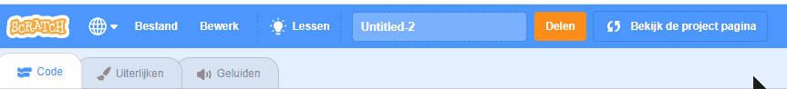
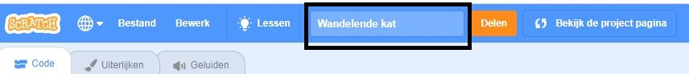
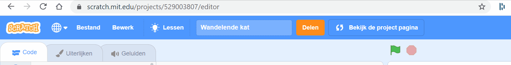
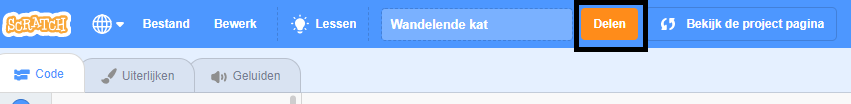
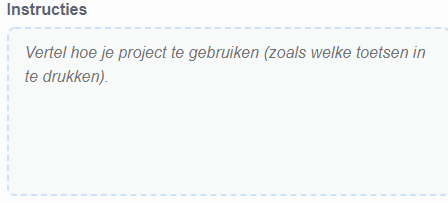
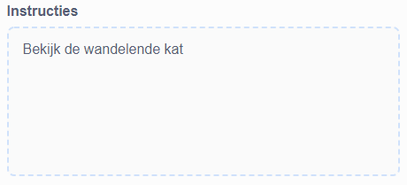
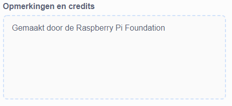
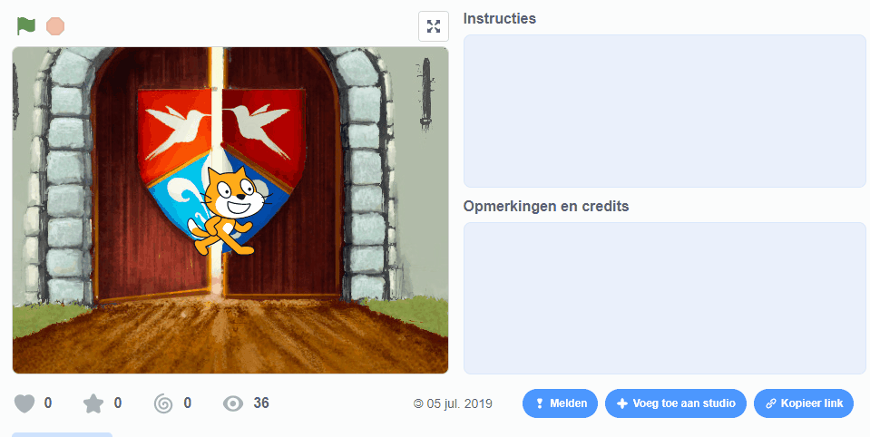
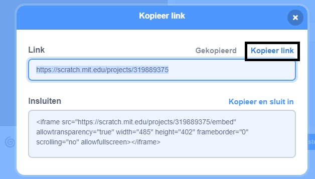
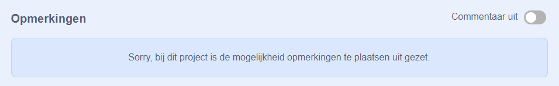

Zorg ervoor dat je **geen** persoonlijke informatie over jezelf deelt als je jouw Scratch projecten deelt.

- Geef je Scratch-project een naam.

--- no-print ---

--- /no-print ---

--- print-only ---

{:width="300px"}

--- /print-only ---

- Klik op de **Delen** knop om het project openbaar te maken.

--- no-print ---

--- /no-print ---

--- print-only ---

{:width="300px"}

--- /print-only ---

- If you like, you can add instructions in the **Instructions** box, to tell other people how to use your project.

--- no-print ---

--- /no-print ---

--- print-only ---

{:width="300px"}

--- /print-only ---

- You can also fill in the **Notes and Credits** box: if you have made an original project, you can write some short comments, or if you have remixed a project, you can credit the original creator.

--- no-print ---

--- /no-print ---

--- print-only ---

{:width="300px"}

--- /print-only ---

- Klik op de **Kopieer link** om de link naar je project te krijgen. Je kunt deze link naar andere mensen sturen via e-mail of sms, of op sociale media.

--- no-print ---

--- /no-print ---

--- print-only ---

{:width="300px"}

--- /print-only ---

Scratch biedt de mogelijkheid om commentaar te geven op je eigen en andermans projecten. Als je niet wilt dat mensen commentaar geven op je project, moet je commentaar uitschakelen. To turn off commenting, set the slider above the **Comments** box to **Commenting off**.

{:width="300px"}
