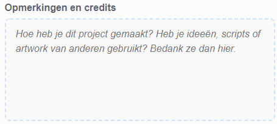

Zorg ervoor dat je **geen** persoonlijke informatie over jezelf deelt als je jouw Scratch projecten deelt.

- Geef je Scratch-project een naam.

--- no-print ---

--- /no-print ---

--- print-only ---

{:width="300px"}

--- /print-only ---

- Klik op de **Delen** knop om het project openbaar te maken.

--- no-print ---

--- /no-print ---

--- print-only ---

{:width="300px"}

--- /print-only ---

- Als je wilt, kun je instructies toevoegen om andere mensen te vertellen hoe ze je project kunnen gebruiken.

--- no-print ---

--- /no-print ---

--- print-only ---

{:width="300px"}

--- /print-only ---

- Als dit een origineel project is, kun je enkele korte opmerkingen toevoegen. Als je het hebt ge-remixed, mag je de naam van de oorspronkelijke maker vermelden.

--- no-print ---

--- /no-print ---

--- print-only ---

{:width="300px"}

--- /print-only ---

- Klik op de **Kopieer link** om de link naar je project te krijgen. Je kunt deze link naar andere mensen sturen via e-mail of sms, of op sociale media.

--- no-print ---

--- /no-print ---

--- print-only ---

{:width="300px"}

--- /print-only ---

Scratch biedt de mogelijkheid om commentaar te geven op je eigen en andermans projecten. Als je niet wilt dat mensen commentaar geven op je project, moet je commentaar uitschakelen.

{:width="300px"}
