Proszę, upewnij się, że **nie** udostępniasz żadnych swoich danych osobowych, gdy dzielisz się z innymi swoimi projektami w Scratchu.

- Nadaj swojemu projektowi w Scratchu nazwę.

--- no-print ---

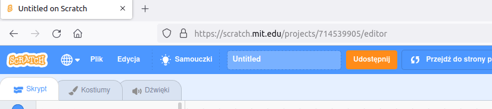

--- /no-print ---

--- print-only ---

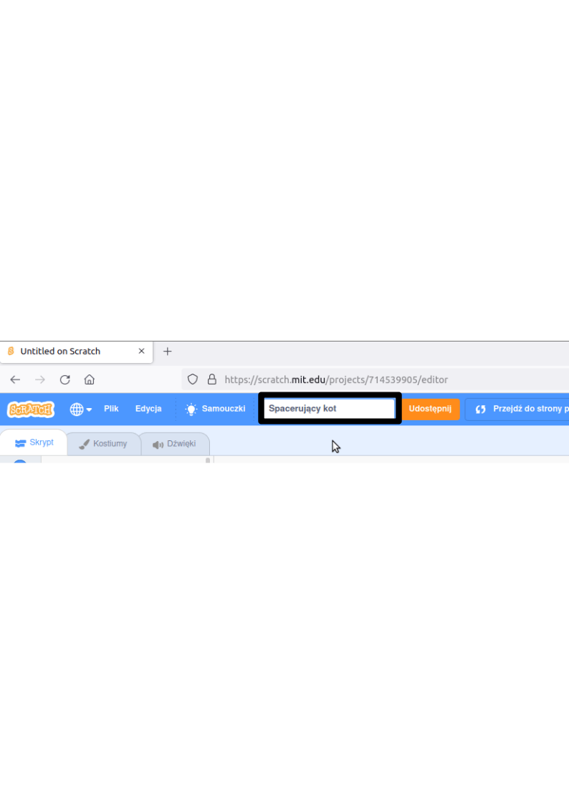{:width="300px"}

--- /print-only ---

- Kliknij przycisk **Udostępnij**, aby upublicznić projekt.

--- no-print ---

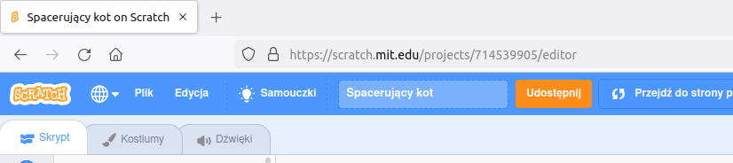

--- /no-print ---

--- print-only ---

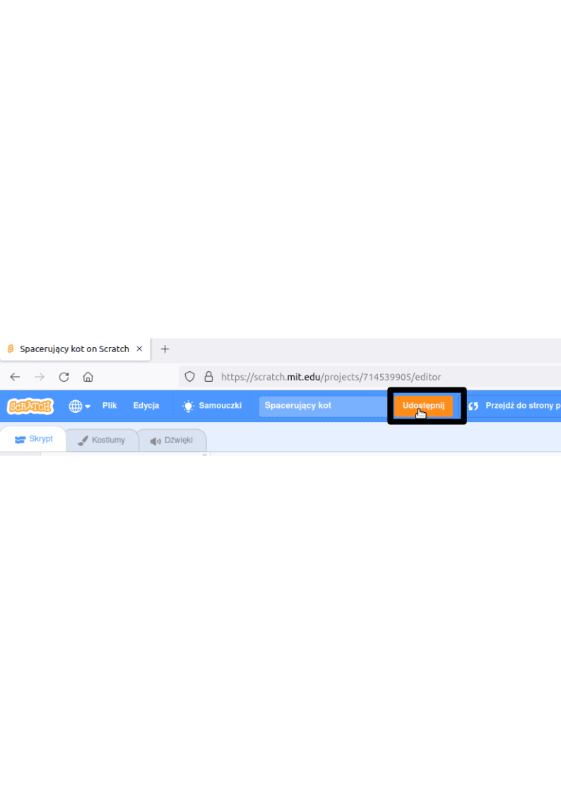{:width="300px"}

--- /print-only ---

- Jeśli chcesz, w polu **Instrukcje** możesz poinformować inne osoby jak korzystać z Twojego projektu.

--- no-print ---

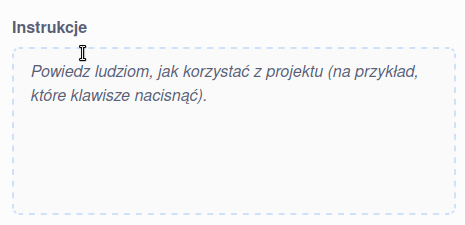

--- /no-print ---

--- print-only ---

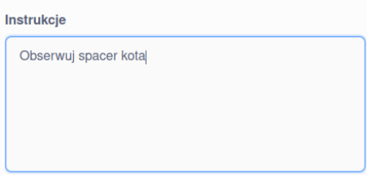{:width="300px"}

--- /print-only ---

- Możesz także wykorzystać pole **Notatki i podziękowania**, aby odnieść się do swojego projektu albo wskazać osobę, której projekt zmodyfikowałaś/eś.

--- no-print ---

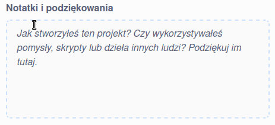

--- /no-print ---

--- print-only ---

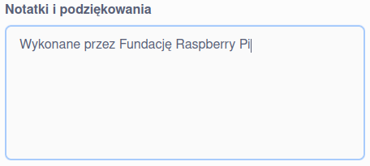{:width="300px"}

--- /print-only ---

- Kliknij **Kopiuj link**, aby otrzymać link do swojego projektu. Możesz wysłać ten link innym osobom e-mailem lub SMS-em albo przez media społecznościowe.

--- no-print ---

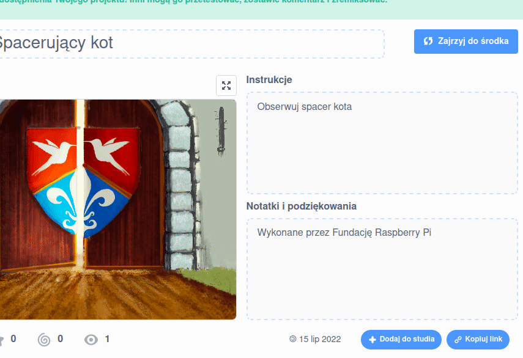

--- /no-print ---

--- print-only ---

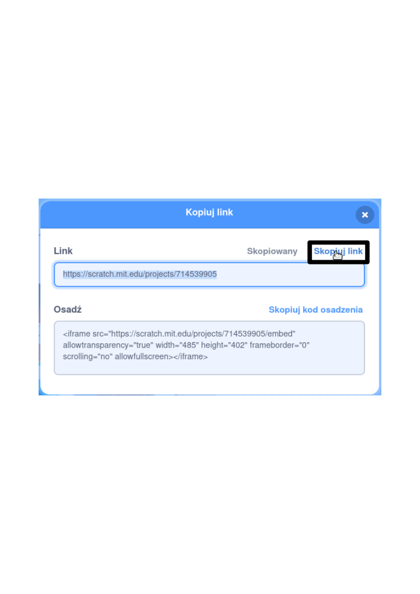{:width="300px"}

--- /print-only ---

Scratch daje możliwość komentowania własnych oraz cudzych projektów. Jeśli nie chcesz, aby inni mogli komentować Twój projekt, zawsze można wyłączyć taką opcję. Aby to zrobić, ustaw suwak nad sekcją **Komentarze** na **Komentowanie wyłączone**.

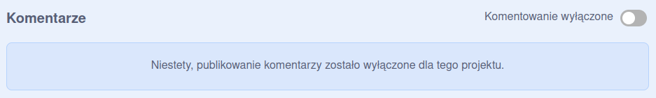{:width="300px"}
