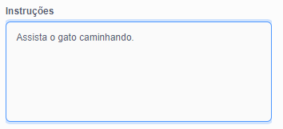

Por favor, verifique se **não** compartilhou nenhuma informação pessoal quando compartilhar seus projetos Scratch.

- Dê um nome ao seu projeto Scratch.

--- no-print ---

--- /no-print ---

--- print-only ---

{:width="300px"}

--- /print-only ---

- Clique em **Compartilhar** para tornar o projeto público.

--- no-print ---

--- /no-print ---

--- print-only ---

{:width="300px"}

--- /print-only ---

- Se desejar, você pode adicionar instruções na caixa **Instruções**, para dizer a outras pessoas como usar seu projeto.

--- no-print ---

--- /no-print ---

--- print-only ---

{:width="300px"}

--- /print-only ---

- Você também pode preencher a caixa **Notas e créditos**: se você fez um projeto original, pode escrever alguns comentários curtos, ou se tiver remixado um projeto, pode creditar o criador original.

--- no-print ---

--- /no-print ---

--- print-only ---

{:width="300px"}

--- /print-only ---

- Clique em **Copiar o Link** para obter o link do seu projeto. Você pode enviar este link para outras pessoas por e-mail, mensagem ou nas redes sociais.

--- no-print ---

--- /no-print ---

--- print-only ---

{:width="300px"}

--- /print-only ---

O Scratch permite comentar em seu próprio projeto e em projetos dos outros. Se você não quiser permitir que as pessoas comentem seu projeto, desative os comentários. Para desativar os comentários, defina o controle deslizante acima da caixa **Comentários** **Comentários desativados**.

{:width="300px"}
