Пожалуйста, убедись, что ты **не** делишься никакой личной информацией о себе, когда делишься своими проектами Scratch.

- Дай имя своему проекту Scratch.

--- no-print ---

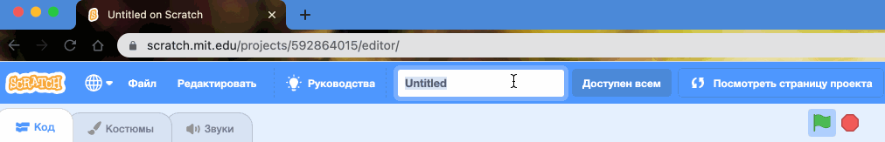

--- /no-print ---

--- print-only ---

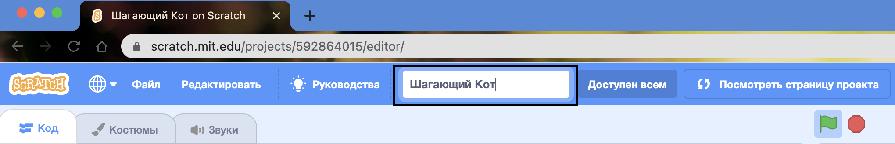{:width="300px"}

--- /print-only ---

- Нажми на кнопку **Поделиться**, чтобы сделать твой проект публичным.

--- no-print ---

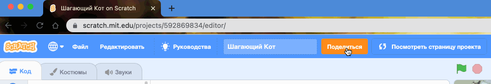

--- /no-print ---

--- print-only ---

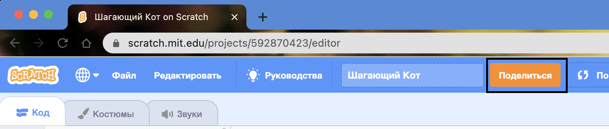{:width="300px"}

--- /print-only ---

- Если хочешь, ты можешь добавить инструкции в поле **Инструкции**, чтобы рассказать другим людям, как использовать твой проект.

--- no-print ---

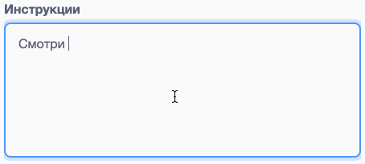

--- /no-print ---

--- print-only ---

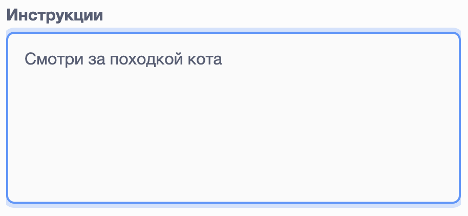{:width="300px"}

--- /print-only ---

- Вы также можешь заполнить поле **Примечания и благодарности**: если ты сделал оригинальный проект, ты можешь написать несколько коротких комментариев или, если ты сделал ремикс проекта, ты можешь указать исходного автора.

--- no-print ---

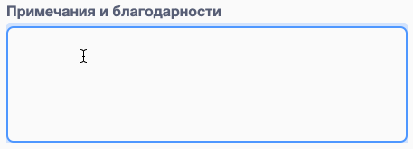

--- /no-print ---

--- print-only ---

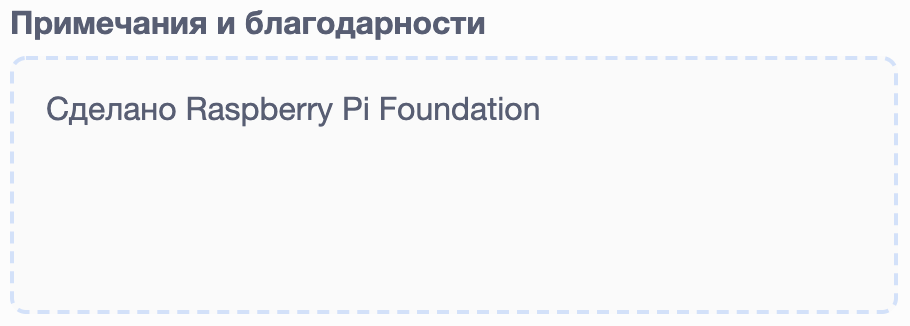{:width="300px"}

--- /print-only ---

- Нажмите кнопку **Копировать ссылку**, чтобы получить ссылку на свой проект. Ты можешь отправить эту ссылку другим людям по электронной почте, в текстовом сообщении или в социальных сетях.

--- no-print ---

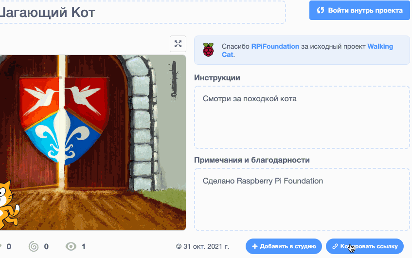

--- /no-print ---

--- print-only ---

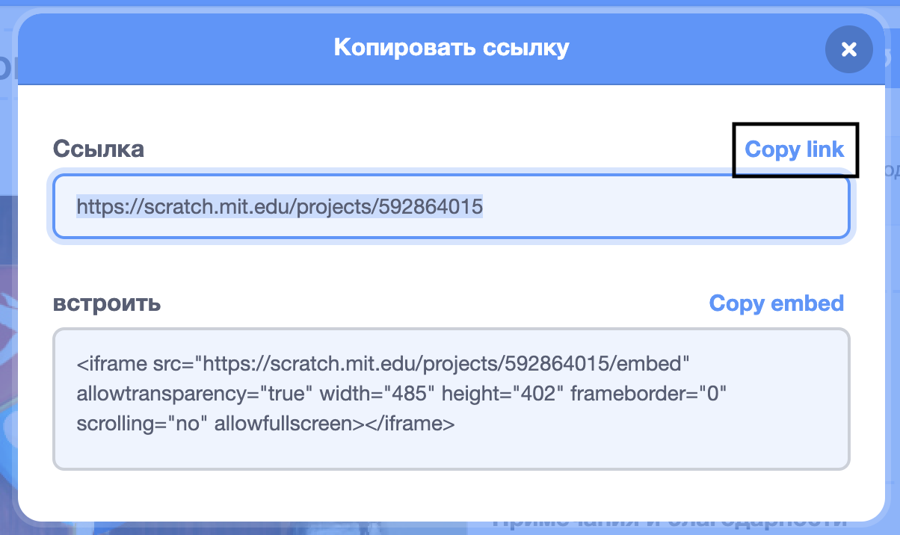{:width="300px"}

--- /print-only ---

Scratch дает возможность комментировать свои и чужие проекты. Если ты не хочешь, чтобы люди комментировали твой проект, отключи комментирование. Чтобы отключить комментирование, перейди на страницу проекта и установи ползунок над полем **Комментарии** в положение **Комментирование отключено**.

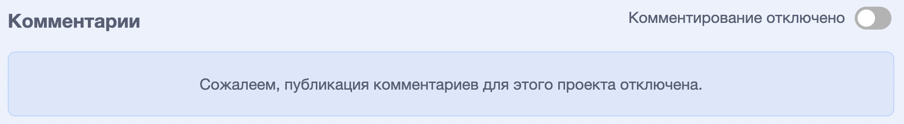{:width="300px"}
