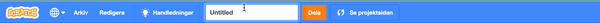

Se till att du**inte** delar någon personlig information när du delar dina Scratch-projekt.

- Ge ditt Scratch-projekt ett namn.

--- no-print ---

--- /no-print ---

--- print-only ---

{:width="300px"}

--- /print-only ---

- Klicka på **Dela**-knappen för att göra projektet offentligt.

--- no-print ---

--- /no-print ---

--- print-only ---

{:width="300px"}

--- /print-only ---

- Om du vill kan du lägga till instruktioner i **Instruktions**rutan för att berätta för andra hur de ska använda ditt projekt.

--- no-print ---

--- /no-print ---

--- print-only ---

{:width="300px"}

--- /print-only ---

- Du kan också fylla i **"Noteringar och beröm"**-rutan: om du har gjort ett eget projekt kan du skriva några korta kommentarer och om du har remixat ett projekt kan du tacka skaparen.

--- no-print ---

--- /no-print ---

--- print-only ---

{:width="300px"}

--- /print-only ---

- Klicka på **"Kopiera länk"**-knappen för att få länken till ditt projekt. Du kan skicka denna länk till andra via mejl eller sms, eller på sociala medier.

--- no-print ---

--- /no-print ---

--- print-only ---

{:width="300px"}

--- /print-only ---

Scratch gör det möjligt att kommentera på dina egna och andras projekt. Om du inte vill att andra ska kunna kommentera på ditt projekt bör du stänga av kommentarer. För att stänga av kommentarer, ställ in reglaget ovanför rutan **Kommentarer** till **Kommentarer av**.

{:width="300px"}
