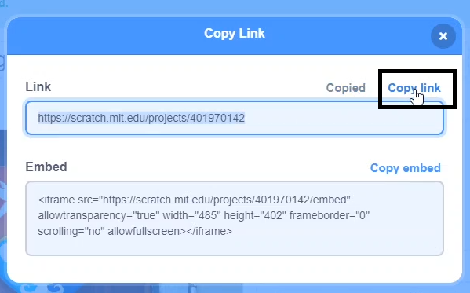

దయచేసి మీరు మీ ప్రాజెక్ట్‌లను షేర్ చేస్తున్నప్పుడు మీ గురించి ఎలాంటి వ్యక్తిగత సమాచారాన్ని షేర్ **చేయలేదని** నిర్ధారించుకోండి.

- మీ Scratch ప్రాజెక్ట్‌కు పేరు పెట్టండి.

--- no-print ---

--- /no-print ---

--- print-only ---

{:width="300px"}

--- /print-only ---

- ప్రాజెక్ట్‌ను పబ్లిక్ చేయడానికి **Share** బటన్‌ను క్లిక్ చేయండి.

--- no-print ---

--- /no-print ---

--- print-only ---

{:width="300px"}

--- /print-only ---

- మీరు కావాలనుకుంటే, మీ ప్రాజెక్ట్‌ను ఎలా ఉపయోగించాలో ఇతర వ్యక్తులకు తెలియజేయడానికి మీరు **Instructions** బాక్సు లో సూచనలను జోడించవచ్చు.

--- no-print ---

--- /no-print ---

--- print-only ---

{:width="300px"}

--- /print-only ---

- మీరు **Notes and Credits** బాక్సు లో కూడా పూరించవచ్చు: మీరు అసలైన ప్రాజెక్ట్‌ను రూపొందించినట్లయితే, మీరు కొన్ని చిన్న వ్యాఖ్యలను వ్రాయవచ్చు లేదా మీరు ప్రాజెక్ట్‌ను రీమిక్స్ చేసి ఉంటే, మీరు అసలు సృష్టికర్తకు క్రెడిట్ చేయవచ్చు.

--- no-print ---

--- /no-print ---

--- print-only ---

{:width="300px"}

--- /print-only ---

- మీ ప్రాజెక్ట్‌కి లింక్‌ని పొందడానికి **Copy Link** బటన్‌ను క్లిక్ చేయండి. మీరు ఈ లింక్‌ని ఇమెయిల్ లేదా టెక్స్ట్ ద్వారా లేదా సోషల్ మీడియాలో ఇతర వ్యక్తులకు పంపవచ్చు.

--- no-print ---

--- /no-print ---

--- print-only ---

{:width="300px"}

--- /print-only ---

Scratch మీ స్వంత మరియు ఇతర వ్యక్తుల ప్రాజెక్ట్‌లపై వ్యాఖ్యానించే సామర్థ్యాన్ని అందిస్తుంది. మీ ప్రాజెక్ట్‌పై వ్యాఖ్యానించడానికి వ్యక్తులను అనుమతించకూడదనుకుంటే, మీరు వ్యాఖ్యానించడాన్ని ఆఫ్ చేయాలి. వ్యాఖ్యానించడాన్ని ఆఫ్ చేయడానికి, **Comments** బాక్సు పైన ఉన్న స్లయిడర్‌ను **Commenting off**కి సెట్ చేయండి.

{:width="300px"}
