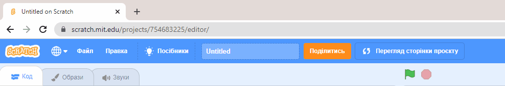
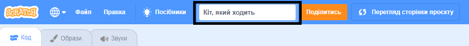
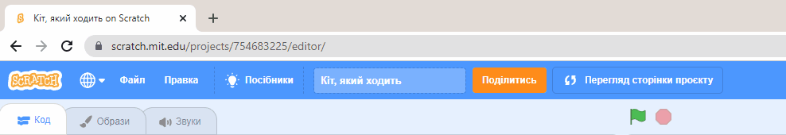
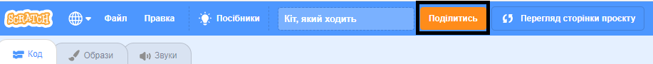
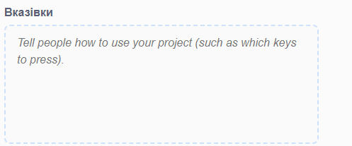
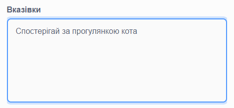
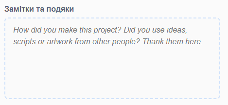
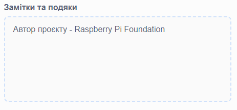
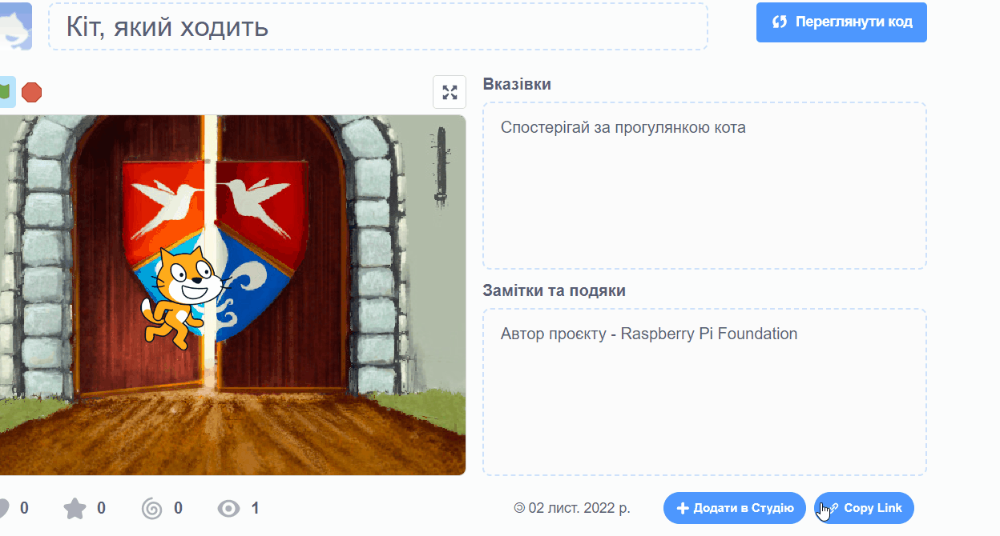
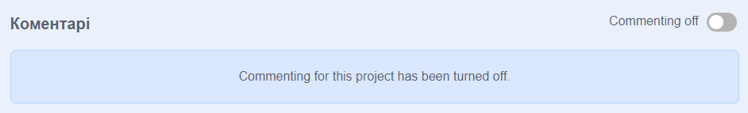

Будь ласка, переконайся, що ти **не** розголошуєш будь-яку особисту інформацію про себе, коли ділишся своїми проєктами Scratch.

- Дай назву своєму проєкту в Scratch.

--- no-print ---

--- /no-print ---

--- print-only ---

{:width="300px"}

--- /print-only ---

- Натисни на кнопку **Поділитись**, щоб зробити проєкт публічним.

--- no-print ---

--- /no-print ---

--- print-only ---

{:width="300px"}

--- /print-only ---

- Якщо хочеш, ти можеш додати інструкції в поле **Вказівки**, щоб пояснити іншим людям, як користуватися твоїм проєктом.

--- no-print ---

--- /no-print ---

--- print-only ---

{:width="300px"}

--- /print-only ---

- Ти також можеш заповнити поле **Замітки та подяки**: якщо твій проєкт є оригінальним, ти можеш написати короткі коментарі, або якщо твій проєкт був перероблений, ти можеш вказати автора оригінального проєкту.

--- no-print ---

--- /no-print ---

--- print-only ---

{:width="300px"}

--- /print-only ---

- Клацни на кнопку **Copy Link**, щоб отримати посилання на твій проєкт. Ти можеш відправити це посилання іншим людям електронною поштою або через повідомлення, або в соціальних мережах.

--- no-print ---

--- /no-print ---

--- print-only ---

{:width="300px"}

--- /print-only ---

Scratch надає можливість коментувати свої та чужі проєкти. Якщо ти не хочеш, щоб люди коментували твій проєкт, тобі слід вимкнути коментарі. Щоб вимкнути коментування, встанови повзунок, який розташований над полем **Коментарі** в положення **Commenting off**.

{:width="300px"}
