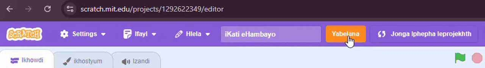
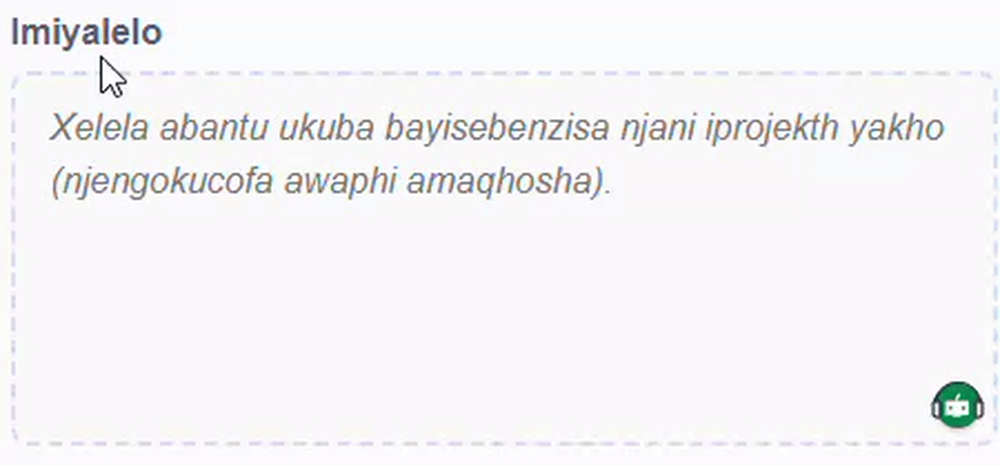
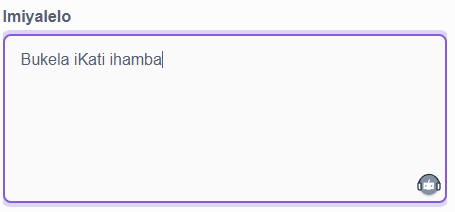
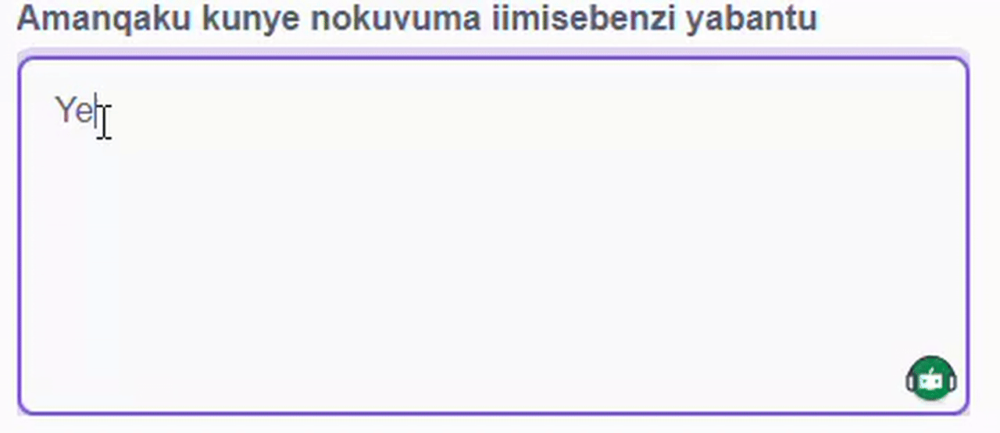
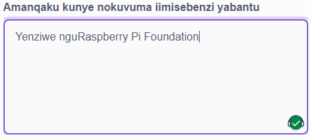
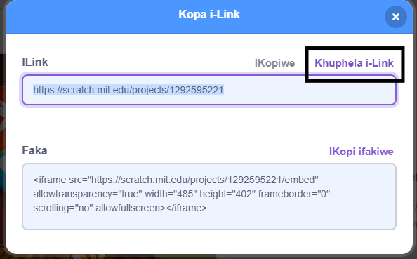
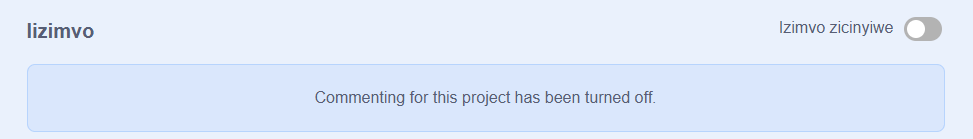

Yenza isiqiniseko sokuba **awabelani** nee ncukacha zakho zobuqu bakho xa usabelana nee projekthi zakho zika Scratch.

- Nika iprojekthi yakho ka Scratch igama.

--- no-print ---

--- /no-print ---

--- print-only ---

{:width="300px"}

--- /print-only ---

- Cofa iqhosha elithi **Yabelana** ukuze wenze iprojekthi ibe sesidlangalaleni.

--- no-print ---

--- /no-print ---

--- print-only ---

{:width="300px"}

--- /print-only ---

- Ukuba uyayithanda, ungongeza imiyalelo kwibhokisi ethi **Imiyalelo**, ukuze uxelele abanye abantu indlela yokusebenzisa iprojekthi yakho.

--- no-print ---

--- /no-print ---

--- print-only ---

{:width="300px"}

--- /print-only ---

- Ungazalisa nebhokisi ethi **Amanqaku kunye neeKhredithi** ukuba wenze iprojekthi yokuqala, ungabhala izimvo ezimfutshane, okanye ukuba udibanise iprojekthi, ungamncoma umdali wokuqala.

--- no-print ---

--- /no-print ---

--- print-only ---

{:width="300px"}

--- /print-only ---

- Cofa iqhosha elithi **Khuphela ikhonkco** ukuze ufumane ikhonkco leprojekthi yakho. Ungathumela eli khonkco kwabanye abantu nge-imeyile okanye ngombhalo, okanye kwimidiya yokuncokola.

--- no-print ---

--- /no-print ---

--- print-only ---

{:width="300px"}

--- /print-only ---

U-Scratch ukunika isakhono sokuba ukwanzi ukuphawula ngeeprojekthi zakho kunye nezabanye abantu. Ukuba awufuni ukuvumela abantu ukuba baphawule kwiprojekthi yakho, kufuneka ucime ukuphawula. Ukucima ukuphawula, seta isilayida esingaphezulu kwebhokisi ethi **Izimvo** kwi **Ukuphawula kucinyiwe**.

{:width="300px"}
